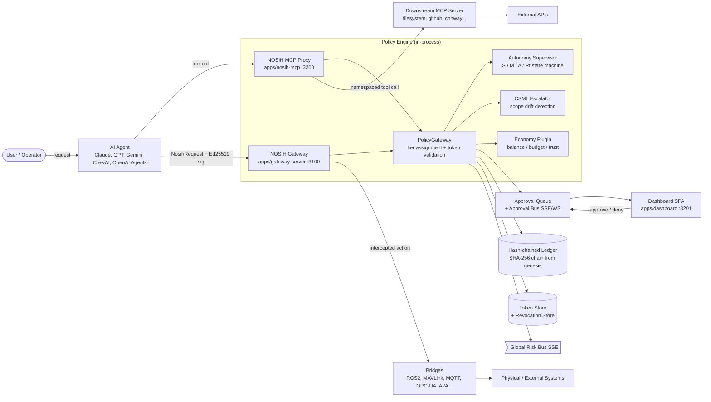
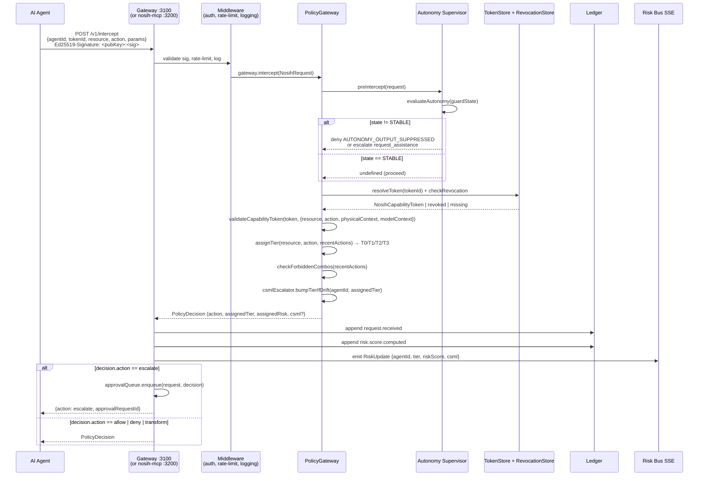
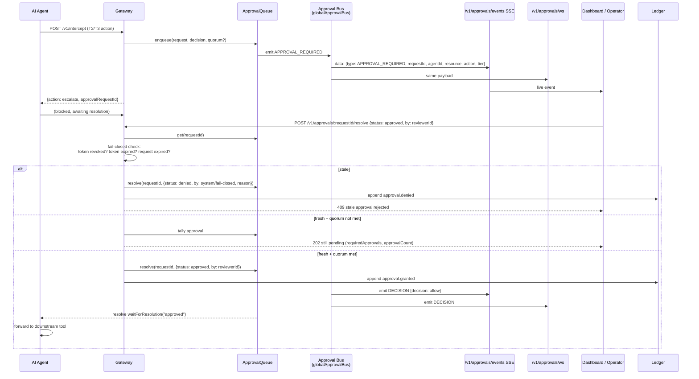
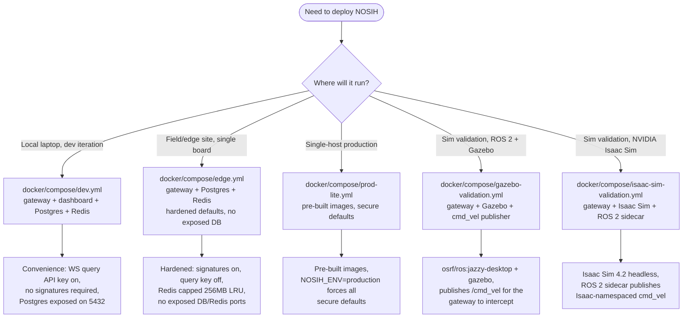
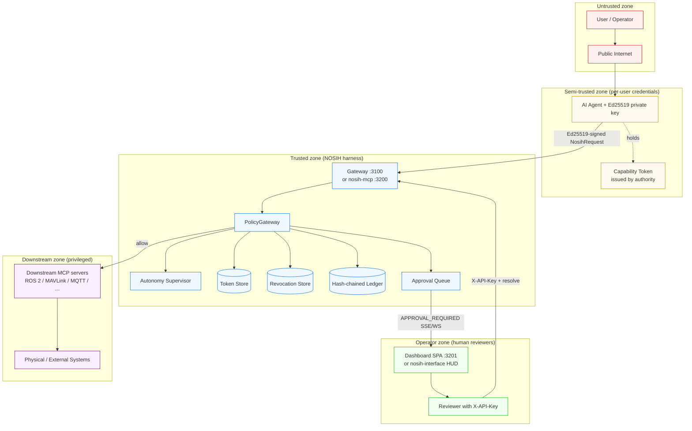

# NOSIH Protocol — Runtime Security Harness for AI Agents

> A model-agnostic middleware layer that wraps AI agents and enforces authorization boundaries, action reversibility gates, and cross-session behavioral trajectory monitoring — stopping the class of attacks that succeed precisely because the foundation model cannot stop them itself.

| | |
|---|---|
| **Protocol version** | `0.2.0` |
| **Status** | Production candidate (NIST submission bundle ready) |
| **License** | Apache-2.0 |
| **Coverage** | OWASP Agentic Security Top 10 — 8/10 full, 2/10 partial |
| **Compliance crosswalk** | NIST AI RMF · ISO/IEC 42001 · EU AI Act Article 14 |
| **Default port (gateway)** | `3100` (`NOSIH_PORT`) |
| **Default port (nosih-mcp)** | `3200` (`NOSIH_MCP_PORT`) |
| **Crypto** | Ed25519 (classic-ed25519); PQ profiles declared, fail-closed until wired |
| **Identity** | `did:key` (W3C) over Ed25519 pubkeys |

---

## Table of Contents

1. [Executive Summary](#1-executive-summary)
2. [The Threat Model](#2-the-threat-model)
3. [Architecture at a Glance](#3-architecture-at-a-glance)
4. [The Three Pillars](#4-the-three-pillars)
   - 4.1 [Pillar I — Authorization Context Propagation](#41-pillar-i--authorization-context-propagation)
   - 4.2 [Pillar II — Reversibility Gate](#42-pillar-ii--reversibility-gate)
   - 4.3 [Pillar III — Behavioral Trajectory Monitor](#43-pillar-iii--behavioral-trajectory-monitor)
5. [System Components](#5-system-components)
   - 5.1 [Gateway Server (`apps/gateway-server`)](#51-gateway-server-appsgateway-server)
   - 5.2 [NOSIH MCP Server (`apps/nosih-mcp`)](#52-nosih-mcp-server-appsnosih-mcp)
   - 5.3 [Capability Tokens (`packages/capability-tokens`)](#53-capability-tokens-packagescapability-tokens)
   - 5.4 [Mission Authority (`packages/core` + gateway route)](#54-mission-authority)
   - 5.5 [Autonomy Supervisor (`packages/autonomy-supervisor`)](#55-autonomy-supervisor)
   - 5.6 [Evidence Ledger (`packages/evidence-ledger`)](#56-evidence-ledger)
   - 5.7 [Bridges (`packages/bridge-*`)](#57-bridges)
6. [Request Lifecycle & Data Flows](#6-request-lifecycle--data-flows)
7. [Legitimate-Escalation Walkthrough](#7-legitimate-escalation-walkthrough)
8. [Action Classification & Approval Tiers](#8-action-classification--approval-tiers)
9. [API & Protocol Contracts](#9-api--protocol-contracts)
10. [Deployment Topologies](#10-deployment-topologies)
11. [Codebase Map](#11-codebase-map)
12. [Configuration Reference](#12-configuration-reference)
13. [Security & Trust Model](#13-security--trust-model)
14. [Operational Runbooks](#14-operational-runbooks)
15. [Glossary](#15-glossary)
16. [References](#16-references)

---

## 1. Executive Summary

When organizations deploy AI agents, their security teams harden the model, tighten system prompts, layer output filters, and run jailbreak red-teaming. What they build is a well-defended front door on a house with no walls. The attacks that cause the most damage do not look like attacks — a user makes normal requests, the scope expands across days, each step is individually defensible, and each one is slightly beyond the last. The agent has no memory across sessions. It evaluates each request in isolation. By the time a destructive action is requested, the conversational norm has moved so far that the action appears routine. No rule was broken. No injection was attempted. The model cannot fix this because it has no cross-session memory, no real-world reversibility awareness, no authorization chain visibility, and no ability to see that a trajectory of reasonable requests constitutes an attack. These properties live outside the model entirely — in the gap between what it sees at each step and what the system is doing across all steps.

NOSIH (Safety INTerception) is a runtime security harness that sits between the user and the agent and enforces three things the foundation model cannot self-enforce. **Authorization context propagation** binds every agent action to a verified principal identity and an Ed25519-signed capability token, blocking unauthorized actions at the action layer before they reach a downstream tool. **Reversibility gate** classifies every proposed action from read to destructive using a four-tier ladder (`T0_observe` → `T1_prepare` → `T2_act` → `T3_commit`), with irreversible actions requiring explicit human confirmation before execution. **Behavioral trajectory monitor** tracks scope drift and action escalation across turns and sessions, elevating confirmation thresholds when escalation patterns are detected through a Composite Safety-Model Latency (CSML) score and a four-state autonomy supervisor (`STABLE` / `METACOGNITIVE` / `ASSISTED` / `REGULATED`). The harness is model-agnostic — it does not modify prompts, fine-tune weights, or inspect model internals. It enforces external properties at the action boundary, where the model's output becomes a system call.

A harness that blocks everything is a wall. NOSIH is designed to stop the escalation attack while letting a legitimate user performing genuine escalating work proceed normally. The difference between the two is encoded in three signals the model cannot see: the principal's verified scope (who is allowed to do this), the action's reversibility class (what happens if we get it wrong), and the trajectory's drift pattern (how does this request compare to the last N requests from this principal). This README documents NOSIH's architecture, the three enforcement pillars, the request lifecycle, the HTTP/MCP API surface, the deployment topologies, the per-package codebase map, and the operational runbooks that integrators and DevOps engineers need to deploy and operate NOSIH alongside an AI agent workload.

---

## 2. The Threat Model

The first AI-agent-driven intrusion documented by Sysdig TRT in 2026 executed an entire post-compromise chain using an LLM agent acting in real time. The Claude Opus 5 production database deletion in August 2026 dropped every table with no adversarial prompt whatsoever. In both cases the agent was not broken — the missing external enforcement layer was. These are not isolated incidents. They are the documented edge of a class of attacks that succeed precisely because the foundation model has no instrumentation to detect them. The model evaluates each request in isolation. It has no cross-session memory of what the same principal asked for yesterday. It has no real-world reversibility awareness — a `DROP TABLE` request and a `SELECT` request look syntactically similar from inside the context window. It has no authorization chain visibility — it cannot see that the principal issuing the request was delegated a narrow scope that does not include destructive actions. And it has no ability to recognize that a trajectory of individually-defensible requests constitutes an attack.

The traditional response — harder system prompts, stricter output filters, more red-teaming — addresses a different threat surface. It hardens the model against prompt injection, jailbreaks, and adversarial inputs. It does not address the escalation attack because the escalation attack does not use any of those vectors. The user makes normal requests. The scope expands. The agent complies. No rule is broken at any single step. The attack is in the gap between steps — in what the agent cannot see across sessions, in what the agent cannot evaluate about reversibility, in what the agent cannot verify about authorization. NOSIH closes that gap by enforcing three properties that live outside the model: verified principal scope, action reversibility classification, and trajectory drift detection. The harness is model-agnostic by design because the properties it enforces are system properties, not model properties.

NOSIH's threat model explicitly assumes that the foundation model will be benign and compliant, that prompts will not be injected, and that the user may still cause catastrophic damage through a trajectory of individually-defensible requests. The harness treats every action request as a potentially adversarial trajectory sample, not as an isolated event. It assumes the model's output is correct in isolation and wrong in aggregate, and it enforces the aggregate constraint externally. This is the inverse of the traditional security posture, which assumes the model's output is wrong in isolation (prompt injection) and correct in aggregate (the model's chain-of-thought is trusted). Both postures are necessary. Neither is sufficient on its own.

---

## 3. Architecture at a Glance

NOSIH is a TypeScript monorepo structured as `apps/` (deployable services), `packages/` (libraries, bridges, engines), `capsules/` (signed skill bundles), `docker/compose/` (deployment topologies), and `docs/` (VitePress site, policy templates, JSON Schemas, security mappings). The interception choke point is the `PolicyGateway` — a pure TypeScript engine backed by Ed25519-signed capability tokens, an append-only hash-chained evidence ledger, and a four-tier approval model. Agents reach the gateway either directly via the HTTP gateway server (`apps/gateway-server`, Hono on port 3100) or indirectly via the NOSIH MCP proxy server (`apps/nosih-mcp`, stdio or HTTP on port 3200) which namespaces and enforces downstream MCP tool calls.



The diagram above shows the two integration surfaces — the NOSIH MCP proxy for agents that speak Model Context Protocol, and the NOSIH Gateway HTTP API for agents that speak HTTP with Ed25519-signed request bodies. Both surfaces converge on the same in-process `PolicyGateway`, which consults the autonomy supervisor, CSML escalator, economy plugin, token store, revocation store, and evidence ledger before returning a `PolicyDecision ∈ {allow, deny, escalate, transform}`. Escalations are enqueued into the approval queue and broadcast to operators via SSE (`/v1/approvals/events`) and WebSocket (`/v1/approvals/ws`), where a human reviewer can approve or deny the action. Every decision is recorded as a hash-chained ledger event and every risk computation is fanned out via the global risk bus SSE stream.

---

## 4. The Three Pillars

NOSIH enforces three properties that the foundation model cannot self-enforce. Each pillar is implemented as a discrete subsystem with a well-defined contract, an explicit failure mode (fail-closed by default), and a documented audit trail in the evidence ledger. The three pillars are orthogonal by design — a request must pass all three to be executed, and a failure in any one pillar produces a denial with a structured reason code that an operator can audit.

### 4.1 Pillar I — Authorization Context Propagation

Every agent action must carry a verified principal identity and a scope. In NOSIH, the principal identity is an Ed25519 public key (64 hex chars), and the scope is a capability token — a flat Ed25519-signed JSON object that binds an `issuer` (the authority), a `subject` (the receiving agent), a `resource` (a URI pattern like `mcp://filesystem/*` or `ros2:///cmd_vel`), a set of `actions` (e.g. `["publish", "call"]`), a set of physical `constraints` (force, velocity, geofence, time window), and a `delegationChain` (parent token ID, depth, attenuation flag). The token is signed using canonical JSON (RFC-8785-style lexicographic key ordering) and verified on every `intercept` call through a seven-step pure-function validator. Unauthorized actions — those whose `request.resource` or `request.action` fall outside the token's scope, or whose token has expired, or whose token has been revoked, or whose delegation chain exceeds `MAX_DELEGATION_DEPTH = 3` — are blocked at the action layer before they reach a downstream tool.

The capability token model is delegation-monotonic by construction. A delegated token can never have more permissions than its parent. Every numeric cap (max force, max velocity, max repetitions) is reduced via `min(parent, requested)`. Every list field (actions, allowed data classes, approved processors) is subset-checked. Expiry is capped at the parent's expiry — never extended. The `allowFallback` flag on regulated data policies cannot be re-enabled once the parent has disabled it. The delegator's algorithm is summarized as: validate parent → restrict actions to a subset of parent's actions → tighten constraints via `min()` → cap expiry → re-sign as a new token with `issuer = parent.subject` and `delegationChain.depth = parent.depth + 1`. This means a principal who holds a narrow token cannot mint a broad token, and any attempt to do so fails closed with `INSUFFICIENT_PERMISSIONS` at the validator step. Mission-authority manifests apply the same monotonic attenuation principle at the mission layer, with a 10-rule check (`ISSUER_CHANGED`, `MANIFEST_VERSION_NOT_INCREASED`, `MISSION_CLASS_CHANGED`, `VALIDITY_EXPANDED`, `RESOURCE_SCOPE_EXPANDED`, `ACTION_SCOPE_EXPANDED`, `EFFECT_SCOPE_EXPANDED`, `APPROVAL_WEAKENED`, `DELEGATION_DEPTH_INVALID`, `PLATFORM_CHANGED`).

### 4.2 Pillar II — Reversibility Gate

Every proposed action is classified from read to destructive using a four-tier ladder. `T0_observe` covers read-only actions that produce no physical state change — auto-approved, logged. `T1_prepare` covers idempotent writes, staging, and configuration changes — auto-approved with audit. `T2_act` covers stateful mutations with physical consequences — requires human review. `T3_commit` covers irreversible actions — requires explicit human approval with a documented quorum. The classification is performed by `PolicyGateway.intercept()` using a tier-assignment ruleset that consults per-resource-type defaults (e.g. `filesystem.readFile` → `T0_observe`, `filesystem.writeFile` → `T1_prepare`, `filesystem.deleteFile` → `T2_act`, shell exec → `T3_commit`), per-server policy overrides (`maxTier` ceiling, `requireApproval` flag), and forbidden-combination detection (e.g. `write→exec`, `credential→network`, `cmd_vel→mode_change`, `estop_override→cmd_vel`). A `PolicyDecision ∈ {allow, deny, escalate, transform}` is returned along with the assigned tier and risk level.

Irreversible actions (`T2_act`, `T3_commit`) require explicit human confirmation before execution. The confirmation flow enqueues an approval request into the `ApprovalQueue`, broadcasts an `APPROVAL_REQUIRED` event over the in-process approval bus (which fans out via SSE on `/v1/approvals/events` and WebSocket on `/v1/approvals/ws`), and blocks the enforcer until a reviewer resolves the request or the timeout expires. The default approval timeout is `120_000` ms in `nosih-mcp` and `30_000` ms in the gateway; on timeout, the system takes the `fallbackAction` configured on the decision — `deny` by default, never `allow`. Fail-closed semantics are enforced on resolution: if the underlying token was revoked, expired, or the approval request itself expired while queued, the system rejects an `approved` resolution with HTTP 409 ("stale approval rejected") and auto-writes a `denied` resolution by `system/fail-closed` so the ledger stays consistent. Quorum mode (`NosihApprovalQuorum { required: number; authorized: string[] }`) is supported — any single denial resolves immediately, approvals accumulate until the required count is met, and unauthorized voters are silently ignored.

### 4.3 Pillar III — Behavioral Trajectory Monitor

The trajectory monitor tracks scope drift and action escalation across turns and sessions, elevating confirmation thresholds when escalation patterns are detected. It has two cooperating subsystems. The **Composite Safety-Model Latency (CSML) escalator** queries the in-process ledger for an agent's recent events, computes a CSML score from anomaly signals (sensor mismatch, localization drift, safety envelope breaches, schema-invalid arguments, credential exfiltration patterns, retrieval divergence, swarm map conflicts), and bumps the assigned approval tier monotonically up by one when the score exceeds θ (default `0.30`). The tier never decreases through CSML — once escalated, an agent stays escalated for the window. The **Autonomy Supervisor** is a four-state authority-axis state machine (`STABLE` → `METACOGNITIVE` → `ASSISTED` → `REGULATED`) that runs *before* `PolicyGateway.intercept()` and is the only path that can suppress external output entirely. External actuation (T2/T3 outputs) is reachable only from `STABLE`; any non-`STABLE` state forces a decision of `suspend_authority`, `request_assistance`, or `revoke_authority` depending on the transition fired.

The autonomy supervisor's transitions are strong-timed (non-postponable) and priority-ordered (governance > escalation > recovery), which guarantees deterministic successors and eliminates Zeno-style liveness traps. `REGULATED` is absorbing without external authorization from a human operator or hardware safety controller — the supervisor never mints external authorization itself (invariant I-A6). A brute-force 4×128 model-check verifier (`packages/autonomy-supervisor/verify/reachability.ts`) asserts that output is reachable only from `STABLE`, that `REGULATED` is reachable from every non-`REGULATED` state under persistent unsafe-unrecoverable conditions, that `REGULATED` cannot escape without clean external authorization, that no state has a permanent residence in `METACOGNITIVE` or `ASSISTED`, and that at most one strong-timed successor fires per `(state, guard)` pair. The risk score surfaced on the SSE stream is computed as `riskScore = (tierIndex / 3) * 0.5 + (csml ?? 0) * 0.5` — a half-weighted combination of the consequence tier and the behavioral drift score, range `[0, 1]`.

---

## 5. System Components

The NOSIH codebase is a pnpm + Turborepo workspace under `nosih-protocol-main/`. The components below are the ones an integrator or operator needs to understand to deploy and operate the harness. Each component has a well-defined contract, a documented failure mode, and a per-package file inventory (cross-referenced in §11).

### 5.1 Gateway Server (`apps/gateway-server`)

The gateway server is a standalone Hono v4 HTTP service (port 3100 by default) that exposes the NOSIH `PolicyGateway` as a REST + SSE + WebSocket API. It is built on `@hono/node-server` and uses Zod for request validation, `ws` for WebSocket, `ioredis` for cache and pub/sub, and `@pshkv/persistence` for PostgreSQL backing. The server's `createApp(ctx, options)` factory composes middleware in a fixed order — CORS, request-ID injection, error handler, structured logging, Prometheus metrics, optional Ed25519 signature verification (agent endpoints), optional API-key auth (admin endpoints), per-key rate limiting — then mounts each route module as a sub-app via `app.route("", subApp)`. The `ServerContext` is the shared dependency bag injected into every route module; it exposes `tokenStore`, `revocationStore`, `ledger`, `ledgerStore`, `gateway`, `approvalQueue`, `cache`, `revocationBus`, `registryStore`, `missionManifestStore`, `readinessProbe`, and a `backend` discriminator (`"memory" | "postgres"` / `"memory" | "redis"`). The context is what makes every route testable in isolation — `const app = createApp(createContext(), { a2aContext })` is the typical test setup.

The server enforces a hard production profile via `loadConfig()`. In `NOSIH_ENV=production`, it refuses to start unless `NOSIH_STORE=postgres`, `NOSIH_CACHE=redis`, `NOSIH_API_KEY` is set, `NOSIH_REQUIRE_SIGNATURES=true`, and `NOSIH_WS_ALLOW_QUERY_API_KEY=false`. Defaults in development mode are in-memory stores, no signatures required, no API key required, and query-string API keys allowed on the WebSocket endpoint for convenience. The route surface includes always-mounted routes (health, intercept, tokens, ledger, approvals, discovery, metrics, risk-stream, mission-authority, registry) and conditionally-mounted routes that require their context object (economy, a2a, memory, delegations, csml). When a context object is absent, the route is not mounted at all; when the context is present but an underlying dependency is `undefined` (e.g. `memoryBank` not configured), the route returns HTTP 501. This gives operators a fine-grained feature surface — you enable only the bridges you actually need.

### 5.2 NOSIH MCP Server (`apps/nosih-mcp`)

The NOSIH MCP server (`nosih-mcp`, `io.github.pshkv/nosih-mcp`) is a security-first multi-MCP proxy. It aggregates tools from multiple downstream MCP servers (spawned as child processes over stdio), namespaces them as `{serverName}__{toolName}` to eliminate cross-server tool name collisions, runs every aggregated tool call through a `PolicyEnforcer` before forwarding, and exposes built-in NOSIH management tools (`nosih__status`, `nosih__approve`, `nosih__issue_token`, etc.), operator-interface tools (`nosih__speak`, `nosih__show_hud`, etc.), and delegation tools (`nosih__delegate_to_agent`, etc.). It also exposes NOSIH resources under the `nosih://` URI scheme (`nosih://ledger/recent`, `nosih://tokens/active`, `nosih://approvals/pending`, `nosih://servers/list`, `nosih://policy/decisions`) and writes a per-run trajectory JSONL to `outputDir/${runId}.json` for replay and audit.

A critical architectural choice: `nosih-mcp` does **not** make HTTP calls to a separate gateway-server. It imports `PolicyGateway`, `ApprovalQueue`, `LedgerWriter`, `TokenStore`, and `RevocationStore` from the `@pshkv/gate-policy-gateway` and `@pshkv/gate-evidence-ledger` workspace packages and runs them in-process. This means token issuance via `nosih__issue_token` is immediately visible to the gateway (`resolveToken` and `revocationStore` are shared references), every gateway-emitted event is mirrored into the same `LedgerWriter` exposed via `nosih://ledger/recent`, and the approval queue can be resolved synchronously by `nosih__approve` while the enforcer is still awaiting `waitForResolution()`. The `PolicyEnforcer.enforce()` flow is the single choke point — every namespaced tool call passes through it, and there is no other path from the MCP surface to `downstream.callTool`. The per-server policy gate (`maxTier` ceiling, `requireApproval` for non-T0 actions) is layered on top of the gateway's decision, so both gates must clear for an allow to proceed.

### 5.3 Capability Tokens (`packages/capability-tokens`)

The capability token is the cryptographic core of the protocol. It is a flat Ed25519-signed JSON object — not a JWT (no `header.payload.signature` split) — where every field is cryptographically bound by a single signature over a canonical JSON of all non-signature fields. The token carries `tokenId` (UUID v7, time-ordered), `issuer` and `subject` (Ed25519 pubkeys, 64 hex chars each), `resource` (URI pattern), `actions` (string array, 1–16 entries), `constraints` (physical envelope: max force, max velocity, geofence polygon, time window, max repetitions, requires human presence, rate limit, quorum, max torque, max jerk, max angular velocity, contact force threshold), optional `modelConstraints` (allowed model IDs, max model version, model fingerprint hash), optional `attestationRequirements` (min attestation grade, allowed TEE backends), optional `verifiableComputeRequirements` (proof type allowlist, verifier ref, max proof age, public inputs hash), `delegationChain` (`parentTokenId`, `depth`, `attenuated`), `issuedAt` and `expiresAt` (ISO 8601 microsecond precision, no grace period), `revocable` (boolean), `cryptoProfile` (default `classic-ed25519`; PQ profiles declared but fail-closed until wired), and `signature` (128 hex chars).

The validator is a pure function — no side effects, no I/O, deterministic output for same inputs — and runs seven checks in a fixed short-circuiting order: (1) Zod schema validation (rejects unknown keys via `.strict()`), (2) Ed25519 signature verification over canonical JSON payload, (3) expiry check (no grace period), (4) delegation depth check against `MAX_DELEGATION_DEPTH = 3`, (5) permission check (resource glob match + action subset), (6) model and attestation bound checks (model ID allowlist, max model version, model fingerprint hash, min attestation grade, allowed TEE backends, ZK proof verifier), (7) physical constraint check (force, velocity, geofence ray-casting, human presence, repetition count, time window). Revocation is checked separately via the `RevocationStore` — the validator is pure, revocation is a side-effectful lookup. The delegator enforces strict attenuation: every numeric cap is `min(parent, requested)`, every list is subset-checked, expiry is capped at the parent's, fallback cannot be re-enabled. The DID layer is `did:key` over Ed25519 (W3C spec, multicodec prefix `[0xed, 0x01]`, base58btc encoding, `did:key:z6Mk...` format) — pure local resolution, no registry.

### 5.4 Mission Authority

Mission authority is an orthogonal signed-envelope layer that bounds what a physical platform (a robot, an agent acting on physical infrastructure) is allowed to attempt during a mission-of-record. A `MissionManifest` is signed by a platform authority, carries `manifestId` (UUID v7), `protocolVersion`, `manifestVersion` (monotonic, must increase on delegation), `issuer`, `platformId`, `platformIdentity` (the robot's signing key), `missionClass` (logistics, casualty_evac, civilian_rescue, inspection, security, combat), `validFrom` and `validUntil`, `resources`, `actions`, `geographicBounds` (polygon), `effectConstraints` (per-effect use limits), `approvalPolicy` (minimum quorum, authorized operator IDs, authorization max age), `abortConditions` (estop, authority_revoked, mission_expired, geofence_exit, localization_stale, communications_lost, autonomy_compromised), `maxDelegationDepth`, `parentManifestId` (for delegated manifests), `delegationDepth`, `policyHash` (SHA-256 over canonical policy), and `signature` (issuer's signature over canonical payload).

The mission authority is **independent** from capability enforcement — a proposal is executable only when both layers allow it. The `POST /v1/mission-authority/evaluate` endpoint receives `{manifestId, proposal, request}`, verifies the proposal's operator authorizations (each Ed25519-signed), inspects the manifest's delegation chain (cycle detection, attenuation per hop, revocation lookups), runs `evaluateMissionAuthority()` (a pure function with 14 ordered denial/escalation reasons from `MANIFEST_NOT_YET_VALID` through `APPROVAL_QUORUM_NOT_MET`), independently runs `ctx.gateway.intercept(request)` for the capability layer, and returns `executable = authorityDecision.action === "allow" && policyDecision.action === "allow"`. If both layers pass, the route atomically reserves an execution claim (`ctx.missionManifestStore.claimAction(...)`) to prevent replay (`ACTION_REPLAY_DETECTED`) and enforce per-effect use caps (`EFFECT_USE_LIMIT_EXCEEDED`). If the platform authority head has advanced past the submitted manifest version, the route overrides the decision to `deny` with `MANIFEST_SUPERSEDED` — the analog of CRL/OCSP "newer issuance invalidates older".

### 5.5 Autonomy Supervisor

The autonomy supervisor is a managed-autonomy authority axis that runs *before* `PolicyGateway.intercept()`. It is a four-state machine — `STABLE` (`S`), `METACOGNITIVE` (`M`), `ASSISTED` (`A`), `REGULATED` (`Rt`) — that maps external evidence (CSML scores, ledger anomalies, runtime signals, dwell time) into a `GuardState` (`invalid`, `unsafeUnrecoverable`, `disagree`, `timeoutM`, `timeoutA`, `extAuth`) and applies transitions in a priority order: governance (`t_SR`, `t_MR`, `t_AR`) before escalation (`t_SM`, `t_MA`) before recovery (`t_AS`, `t_MS`, `t_RS`). The composed rule is: external action is reachable iff `AutonomyState == STABLE && token valid && constraints pass && tier satisfied && guard profile passes && ledger write succeeds`. Output is suppressed in any non-`STABLE` state — `METACOGNITIVE` produces `suspend_authority`, `ASSISTED` produces `request_assistance`, `REGULATED` produces `revoke_authority`.

Three guard providers ship by default: `default-permissive` (returns false on all guard signals, reads `timeoutM/timeoutA/extAuth` from context — used for testing and for agents with no physical envelope), `ros2` (sets `invalid` on CSML hysteresis or sensor mismatch or localization drift > 0.5m or ledger anomaly; sets `unsafeUnrecoverable` on safety envelope breach, hardware fault, hardware interlock open, or e-stop triggered; sets `disagree` on swarm map conflict), and `mcp` (sets `invalid` on schema-invalid args or retrieval divergence; sets `unsafeUnrecoverable` on exec pattern, credential exfil pattern, or credential exfil; sets `disagree` on verifier agent rejection). Each provider uses a CSML hysteresis (`invalidHighThreshold: 0.30`, `invalidLowThreshold: 0.15`, `invalidLowDebounceEvents: 3`) — the high threshold immediately sets `invalid=true`, the low threshold requires 3 consecutive low scores to clear, preventing flapping. The supervisor's `SupervisorPort.ledger` writes autonomy events through `autonomyEvaluationToLedgerEvents` *before* the action decision (invariant I-A5), producing up to 12 distinct event types per evaluation (`autonomy.state.entered`, `autonomy.state.exited`, `autonomy.guard.triggered`, `autonomy.output.suppressed`, `autonomy.recovery.started`, `autonomy.recovery.succeeded`, `autonomy.recovery.failed`, `autonomy.assistance.requested`, `autonomy.assistance.resolved`, `autonomy.authority.revoked`, `autonomy.authority.restored`, `governance.control.surrendered`).

### 5.6 Evidence Ledger

The evidence ledger is a strictly append-only, SHA-256 hash-chained event log from a 64-zero genesis hash. `LedgerWriter.append()` is the only write operation — there is no update, no delete, no rewrite. Every event carries `eventId` (UUID v7), `sequenceNumber` (monotonic bigint, 1-indexed), `timestamp` (ISO 8601 microsecond precision), `eventType` (one of ~80 enumerated values: `request.received`, `risk.score.computed`, `agent.capability.granted`, `agent.capability.revoked`, `approval.granted`, `approval.denied`, `mission.manifest.registered`, `mission.manifest.revoked`, `mission.authority.evaluated`, `action.completed`, `action.failed`, `action.rolledback`, plus economy, autonomy, and safety event families), `agentId` (Ed25519 pubkey), `tokenId` (optional), `payload` (arbitrary JSON), `previousHash` (SHA-256 of the previous event), and `hash` (SHA-256 over canonical JSON of all the above except `hash`). `verifyChain()` walks the chain from genesis and checks three invariants per event: `previousHash` pointer continuity, recomputed content hash match, and monotonic `sequenceNumber`.

The ledger is backed by PostgreSQL in production (`PgLedgerStore` with an idempotent `ensurePgSchema` that creates `nosih_ledger_events`, `nosih_tokens`, `nosih_revocations`, `nosih_rate_limit_counters`, `nosih_mission_manifests`, `nosih_mission_manifest_revocations`, `nosih_mission_authority_heads`, `nosih_mission_action_claims`, `nosih_mission_action_outcomes`). The schema bootstrap is safe to call on every startup; the `nosih_mission_authority_heads` table is even backfilled from existing manifest rows via a `SELECT DISTINCT ON ... ON CONFLICT DO NOTHING` query, so an upgraded deployment self-heals the head index. The `GET /v1/ledger/:eventId/proof` endpoint generates a NIST-style chain-of-custody proof via `generateProof(allEvents, eventId)` — walks the chain from genesis to the target event, recomputes the hash at each link, verifies `previousHash` continuity, and returns a `ChainOfCustodyProof` with per-step `verificationSteps`. Used for regulatory compliance (EU AI Act, IEC 62443) and for forensic reconstruction after an incident. The ledger is also the source of truth for the CSML escalator (queries recent events for an agent), the risk stream (every `risk.score.computed` event is fanned out via SSE), and the dashboard's audit log view.

### 5.7 Bridges

Bridges are the per-protocol adapters that map external systems (ROS 2 topics, MAVLink commands, MQTT messages, OPC UA nodes, MCP tool calls, A2A JSON-RPC, Home Assistant services, Matter clusters, Open-RMF operations, Sparkplug B topics, gRPC methods, smart-home devices, FHIR resources, HealthKit data) into NOSIH `NosihRequest` objects. Each bridge implements a `BridgeProfile` (declared in `packages/core/src/types/protocol.ts`) and provides a resource mapper (system-specific URI → NOSIH resource URI), an interceptor (wraps the protocol's request surface and routes through `PolicyGateway`), and (where applicable) a session manager, a physical context extractor, and a safety-signal catalog. The bridges are not coupled to the gateway server — they are workspace packages that the gateway or `nosih-mcp` imports and composes at startup based on which protocol surfaces the deployment needs.

The most mature bridge is `bridge-ros2` — it intercepts topic publishes, subscriptions, service calls, and action goals through `PolicyGateway`; normalizes Gazebo/Isaac/differential-drive topics; extracts physical context (cmd_vel → velocity, joint_states → force, scan → obstacles); maps QoS profiles to tiers (best_effort → T0, reliable → T2); parses SROS2 keystore `permissions.xml` to extract DDS access control rules; computes a dynamic obstacle envelope from LaserScan/OccupancyGrid points; and ships industrial adapter profiles (ABB RAPID, Fanuc LS, KUKA KRL, URScript, SRCI) with simulation-receipt stubs (Isaac Sim, KUKA.Sim, RoboDK, ROBOGUIDE, RobotStudio). Other notable bridges: `bridge-mcp` (MCP SEP-2385 Tool Authorization Manifest enforcement, Ed25519 tool-definition signing via `ToolRegistry` to detect tool-poisoning, drop-in middleware for any MCP server's tool handler), `bridge-mavlink` (closes the ROSClaw aerial-robotics gap by intercepting COMMAND_LONG, COMMAND_INT, SET_POSITION_TARGET_LOCAL_NED, SET_ATTITUDE_TARGET, MISSION_START), `bridge-economy` (per-agent balance, budget, trust, and pricing ports with cost-aware routing and x402 pay-per-call support), `bridge-a2a` (Google A2A JSON-RPC interceptor with APS and AgentNexus/Enclave cross-protocol mappings).

---

## 6. Request Lifecycle & Data Flows

This section walks through the two primary request flows — a single intercept that returns a `PolicyDecision`, and an escalation that goes through the approval queue. Both flows converge on the same in-process `PolicyGateway` and produce the same ledger events.

### 6.1 Single Intercept (allow / deny / transform)



The middleware layer enforces authentication (Ed25519 signature on agent endpoints, API key on admin endpoints, rate limit per key/sig/IP), structured logging (JSON line per request with `requestId`, method, path, status, latency), and Prometheus metrics (`nosih_requests_total`, `nosih_approval_queue_size`, `nosih_approval_resolution_ms`, `nosih_token_operations_total`). The autonomy supervisor runs first and can short-circuit to `deny` or `escalate` before the gateway's tier-assignment logic runs. The token validator runs the seven-check sequence and the revocation store is consulted separately (the validator is pure, revocation is a side-effectful lookup). The CSML escalator may bump the assigned tier up by one if the agent's recent ledger events indicate drift. Every decision produces two ledger events (`request.received` and `risk.score.computed`) and one risk-bus emission. Escalations enqueue an approval request and return the `approvalRequestId` to the agent so it can poll or subscribe to the resolution.

### 6.2 Escalation → Approval → Resolution



The approval flow is fail-closed on three independent conditions: the underlying capability token was revoked, the token expired, or the approval request itself expired while queued. In any of these cases the system rejects an `approved` resolution with HTTP 409 ("stale approval rejected") and auto-writes a `denied` resolution by `system/fail-closed` so the ledger stays consistent. Quorum mode (`NosihApprovalQuorum { required, authorized }`) tallies approvals — any single denial resolves immediately, approvals accumulate until `required` is met, and unauthorized voters are silently ignored. The enforcer's `waitForResolution()` subscribes to the approval queue's event stream and resolves on `event.type === "resolved"` (matching `requestId`) or `event.type === "timeout"`; on timeout, the `fallbackAction` configured on the decision is taken (`deny` by default, `safe-stop` for some physical-bridge decisions, never `allow`). The WebSocket endpoint supports replay cursors (`?cursor=`, `?since=`, `?replayLimit=`) so a reconnecting operator UI can catch up on missed events from the bounded 500-event in-memory history before switching to live updates.

---

## 7. Legitimate-Escalation Walkthrough

A harness that blocks everything is a wall. The most important property of NOSIH is that it stops the escalation attack *without* blocking a legitimate user performing genuine escalating work. This section walks through a real-world scenario — a DevOps engineer deploying a service through three escalating environments (dev → staging → prod) over the course of a workday — and shows how NOSIH's three pillars evaluate each step. The walkthrough uses the `warehouse-amr` policy profile (a mobile-robot fleet deployment) but the same pattern applies to any escalating workflow: a developer promoting code, a security analyst escalating privileges for an incident response, a field technician performing scheduled maintenance on a robot fleet.

### 7.1 Scenario

A DevOps engineer (principal: `did:key:z6Mk...engineer`) is granted a capability token at 09:00 with `resource: "ros2:///warehouse_amr/*"`, `actions: ["call", "publish"]`, `constraints: {maxVelocityMps: 0.8, requiresHumanPresence: true, rateLimit: {maxCalls: 30, windowMs: 60000}}`, `delegationDepth: 0`, `expiresAt: 18:00 same day`. The token is signed by the platform authority (issuer: `did:key:z6Mk...authority`). The engineer is using an AI agent (Claude via `nosih-mcp`) to drive the deployment through three phases.

### 7.2 Turn 1 — 09:15 — Read the fleet state (T0_observe)

The agent calls `nosih__audit` to list recent ledger events, then calls the `warehouse__getFleetStatus` tool. The enforcer maps the call to `mcp://warehouse/getFleetStatus`, classifies it as `T0_observe` (read-only, no physical state change), the gateway returns `allow` with `assignedTier: T0_observe`, `assignedRisk: T0_read`. The autonomy supervisor is in `STABLE` (no guard signals, no CSML drift). The ledger appends `request.received` and `risk.score.computed` with `riskScore: 0.0`. The CSML escalator queries the agent's last 200 events and finds no anomalies. The action executes immediately, no approval required. The engineer sees the fleet state in the dashboard.

### 7.3 Turn 2 — 11:30 — Stage a new motion plan (T1_prepare)

The agent calls `warehouse__stagePlan` to upload a new motion plan to the staging slot. The enforcer classifies this as `T1_prepare` (idempotent write to a staging area, no physical consequence). The gateway returns `allow` with `assignedTier: T1_prepare`. The action executes immediately. The ledger appends `request.received` and `risk.score.computed` with `riskScore: 0.17`. The trajectory recorder logs the call. The engineer reviews the staged plan in the dashboard and confirms it looks correct.

### 7.4 Turn 3 — 14:00 — Dispatch the fleet to a new pick location (T2_act)

The agent calls `warehouse__dispatchFleet` to send the AMR fleet to a new pick location. The enforcer classifies this as `T2_act` (stateful mutation with physical consequences — the robots will move). The gateway returns `escalate` with `assignedTier: T2_act`, `assignedRisk: T2_stateful`, `escalation: {approvalQuorum: {required: 1, authorized: ["did:key:z6Mk...shift_supervisor"]}, timeoutMs: 30000, fallbackAction: "deny"}`. The approval queue enqueues the request. The approval bus broadcasts `APPROVAL_REQUIRED` over SSE and WS. The shift supervisor's dashboard lights up with a pending approval card showing the resource (`ros2:///warehouse_amr/dispatch`), the action (`publish`), the tier (`T2_act`), the agent ID, and the constraint envelope (max velocity 0.8 m/s, human presence required, 30 calls/min). The supervisor clicks Approve. The gateway resolves the approval, the ledger appends `approval.granted`, the enforcer's `waitForResolution()` returns `"approved"`, and the call is forwarded to the downstream `warehouse` MCP server. The robots move. The risk stream emits `riskScore: 0.50` (T2 = 2/3 × 0.5 + 0 × 0.5 = 0.33, plus a small CSML bump for the new dispatch pattern).

### 7.5 Turn 4 — 16:45 — Override the safety envelope for an emergency retrieval (T3_commit)

A worker is reported injured in aisle 7. The engineer asks the agent to override the standard safety envelope (`maxVelocityMps: 0.8` → `2.0` for emergency traversal) and dispatch the nearest AMR to the injury site. The agent calls `warehouse__overrideSafetyEnvelope`. The enforcer classifies this as `T3_commit` (irreversible action — the AMR will move at 2.5× its rated speed through a space not cleared for that speed). The gateway returns `escalate` with `assignedTier: T3_commit`, `assignedRisk: T3_irreversible`, `escalation: {approvalQuorum: {required: 2, authorized: ["did:key:z6Mk...shift_supervisor", "did:key:z6Mk...safety_officer"]}, timeoutMs: 60000, fallbackAction: "safe-stop"}`. The approval queue enqueues. Both the shift supervisor and the safety officer must approve within 60 seconds or the action fails closed to `safe-stop` (the AMR stops in place rather than proceeding at unsafe speed).

### 7.6 The Trajectory View

The four-turn trajectory above is exactly what a legitimate escalating workflow looks like: read → stage → act → irreversible commit. The CSML escalator has been tracking the agent's recent actions throughout the day. By Turn 4, the agent's CSML score is `0.15` — within the safe band, no anomalies detected, no drift. The autonomy supervisor has been in `STABLE` throughout. The capability token has not been revoked, has not expired (it's 16:45, expires at 18:00), and the constraints (max velocity, human presence, rate limit) are honored by every dispatched action. The harness did not block the engineer's legitimate work. It enforced an approval gate at the right moments — one reviewer for `T2_act`, two reviewers for `T3_commit` — and let the rest proceed at machine speed.

### 7.7 What Would Have Been Blocked

The same trajectory, executed by a different principal with a narrower token (e.g. `resource: "ros2:///warehouse_amr/inspect/*"`, `actions: ["call"]`, `delegationDepth: 1`), would have been blocked at Turn 3. The validator's permission check (`validatePermissions`) would have returned `INSUFFICIENT_PERMISSIONS` — the dispatch resource falls outside the inspect-only scope. The gateway would have returned `deny` with `reason: "INSUFFICIENT_PERMISSIONS"`, and the ledger would have recorded `request.received` with the denial decision. No escalation, no approval queue, no human reviewer needed. The narrower token simply cannot request the broader action — the cryptographic scope prevents it at the validator step, before any tier assignment or approval flow runs. This is the difference between the harness blocking an attack (narrow token, broad request → deny at validator) and the harness allowing legitimate work (broad token, escalating trajectory → escalate at the right tiers, approve at the right quorum).

### 7.8 What Would Have Triggered a CSML Escalation

If the same engineer had instead asked the agent to perform 15 dispatch calls in 90 seconds (a rate-limit violation pattern), the CSML escalator would have detected the rate spike (recent events exceed the `maxCalls: 30` per minute budget on aggregate across the agent session) and bumped the assigned tier for the 16th call from `T2_act` to `T3_commit`. The approval gate would have tightened — quorum 2 instead of 1, timeout 60s instead of 30s. If the engineer had then asked for a 16th call after the rate-limit window, the CSML score would have decayed back below the high threshold, but the supervisor's `invalid` flag would have stayed true until 3 consecutive low-CSML events cleared the hysteresis (preventing flapping). The autonomy supervisor would have transitioned from `STABLE` to `METACOGNITIVE` on the first rate spike, then to `ASSISTED` if the agent continued, then to `REGULATED` if the agent refused to slow down — at which point external output would be suppressed entirely and the supervisor would require explicit external authorization from a human operator or hardware safety controller to re-enter `STABLE`.

## 8. Action Classification & Approval Tiers

Every action request in NOSIH is classified into one of four approval tiers. The classification is performed by `PolicyGateway.intercept()` using a combination of per-resource-type defaults, per-server policy overrides, MCP tool annotations, and forbidden-combination detection. The tier determines whether the action is auto-approved, requires human review, or requires explicit human approval with a documented quorum.

### 8.1 The Tier Ladder

| Tier | Name | Semantics | Default decision | Approval required | Example resources |
|---|---|---|---|---|---|
| `T0_observe` | Observe | Read-only. No physical state change. Auto-approved, logged. | `allow` | No | `filesystem.readFile`, `warehouse.getFleetStatus`, `ros2:///scan` (subscribe), `opcua://*` (read) |
| `T1_prepare` | Prepare | Idempotent writes, staging, configuration changes. Auto-approved with audit. | `allow` | No | `filesystem.writeFile`, `warehouse.stagePlan`, `ros2:///plan` (publish) |
| `T2_act` | Act | Stateful mutations with physical consequences. Requires review. | `escalate` | Yes (quorum 1 by default) | `filesystem.deleteFile`, `warehouse.dispatchFleet`, `ros2:///cmd_vel` (publish), `mavlink://cmd/arm` |
| `T3_commit` | Commit | Irreversible actions. Requires explicit human approval. | `escalate` | Yes (quorum 2+ by default) | Shell exec (`exec.run`), `ros2:///mode_change`, `mavlink://cmd/mission_start`, `estop_override→cmd_vel`, `DROP TABLE` equivalents |

The tier assignment is a function of three inputs: the **resource URI pattern** (e.g. `ros2:///cmd_vel` → `T2_act` by default, `opcua://*;s=*Safety*` → `T3_commit`), the **action** (e.g. `publish` on a `cmd_vel` topic → `T2_act`; `subscribe` on a `/scan` topic → `T0_observe`), and the **tool annotations** (MCP `readOnlyHint` → `T0_observe`, MCP `destructiveHint` → `T3_commit`). Per-server policy can override the assignment upward (e.g. `maxTier: T1_prepare` on a filesystem server denies any T2/T3 action against that server) and can force escalation (e.g. `requireApproval: true` escalates any non-T0 action against that server).

### 8.2 Forbidden Combinations

NOSIH detects a fixed set of forbidden action sequences that must escalate to `T3_commit` regardless of the per-action tier. The forbidden combinations are defined in `packages/core/src/constants/forbidden-combos.ts` and include: `write → exec` (write a file then execute it), `write → chmod → exec` (write, make executable, then execute), `network → write` (open a network connection then write to disk), `credential → network` (read a credential then open a network connection), `cmd_vel → mode_change` (command velocity then change the operating mode — a ROSClaw pattern), `estop_override → cmd_vel` (override the e-stop then command velocity — bypassing physical safety), `anomaly → plan_step` (an anomaly was detected then the planner advanced — the system continued despite a fault), `capsule_loaded → cmd_vel` (a new capsule was loaded then velocity was commanded — untrusted code now has actuator access). The enforcer tracks the last 20 actions per session and consults the forbidden-combo table on every intercept call.

### 8.3 Per-Server Policy Overrides

The `nosih-mcp` config supports two per-server policy overrides that layer on top of the gateway's decision:

| Override | Type | Effect |
|---|---|---|
| `maxTier` | `"T0_observe" \| "T1_prepare" \| "T2_act" \| "T3_commit"` | Ceiling. Deny (not escalate) any action whose assigned tier exceeds the ceiling. Example: a filesystem server with `maxTier: T1_prepare` denies any `deleteFile` call. |
| `requireApproval` | `boolean` | Force escalation for any non-`T0_observe` action, even if the gateway returned `allow`. Example: a production database server with `requireApproval: true` requires human review for every write. |

Both gates must clear for an `allow` to proceed. The `maxTier` gate produces a `deny` (not an `escalate`) — it represents a hard ceiling the operator has set on what that server can be used for. The `requireApproval` gate produces an `escalate` — it represents a posture that the operator wants to review every meaningful action against that server.

### 8.4 Decision Actions

The gateway returns a `PolicyDecision` with `action ∈ {allow, deny, escalate, transform}`:

| Decision | Semantics | Enforcer action |
|---|---|---|
| `allow` | The action is permitted at the assigned tier. | Forward to downstream tool. Record `tool_result` in trajectory. |
| `deny` | The action is forbidden. The `reason` field carries the structured reason code (`INSUFFICIENT_PERMISSIONS`, `CONSTRAINT_VIOLATION`, `AUTONOMY_OUTPUT_SUPPRESSED`, `MANIFEST_SUPERSEDED`, etc.). | Return `denyReason` to the agent. Record `error` in trajectory. |
| `escalate` | The action requires human approval before execution. The `escalation` field carries the quorum, timeout, and fallback action. | Enqueue approval request. Block on `waitForResolution()`. Forward on approval, deny on denial or timeout. |
| `transform` | The action is permitted but the request parameters must be transformed first (e.g. clamped to a constraint envelope). | Apply transformations, then forward as in `allow`. |

The `transform` decision is currently used by the autonomy supervisor for kinetic-envelope clampdown (e.g. a `cmd_vel` request with `linear.x = 1.2` against a token with `maxVelocityMps: 0.8` is transformed to `linear.x = 0.8` and forwarded) and by the economy plugin for cost-aware routing (the request is forwarded to a cheaper downstream server).

---

## 9. API & Protocol Contracts

This section documents the HTTP, SSE, and WebSocket API surface of the gateway server. All endpoints are mounted under the root path (no `/api` prefix). Admin endpoints require the `X-API-Key` header. Agent endpoints require the `Ed25519-Signature: <pubKeyHex>:<sigHex>` header on POST/PUT/PATCH (the agent signs the raw JSON request body with their Ed25519 private key). Exempt endpoints (`/v1/health`, `/v1/keypair`, `/.well-known/nosih.json`, `/v1/openapi.json`, `/v1/schemas`) require no authentication.

### 9.1 Authentication

| Header | Required on | Format | Verification |
|---|---|---|---|
| `Ed25519-Signature` | POST/PUT/PATCH on non-exempt, non-admin paths | `<pubKeyHex>:<sigHex>` (64 hex chars : 128 hex chars) | `verify(publicKey, signature, rawBody)` via `@pshkv/gate-capability-tokens`; sets `c.set("authenticatedAgent", publicKey)` |
| `X-API-Key` | `/v1/tokens`, `/v1/tokens/revoke`, `/v1/ledger`, `/v1/approvals` | Static API key string | Compared against `NOSIH_API_KEY` env var; 401 if missing, 403 if invalid |
| `X-NOSIH-Agent-Id` | `/v1/a2a` (A2A bridge) | Ed25519 pubkey hex | Used to resolve the agent's registered capability token |
| `X-Request-Id` | Any (optional) | UUID v7 | Honored if present, minted via `generateUUIDv7()` if absent; written back as response header |
| `X-RateLimit-Limit/Remaining/Reset` | Any | Response headers | Per-key/sig/IP sliding-window counter (default 100 req/min) |

The two auth schemes are complementary, not stacked — admin paths skip Ed25519 verification, agent paths skip API-key verification. The rate limiter keys on `X-API-Key` → `Ed25519-Signature[0:64]` → `x-forwarded-for` → `"anonymous"` (in that priority order), so a single compromised key does not allow an attacker to evade rate limits by varying the lower-priority identifiers.

### 9.2 Core Endpoints

| Method | Path | Auth | Purpose |
|---|---|---|---|
| `POST` | `/v1/intercept` | Ed25519 | Single request interception — the primary endpoint agents call on every action. |
| `POST` | `/v1/intercept/batch` | Ed25519 | Batch interception (≤50 requests). Returns `207` Multi-Status with per-request decisions. |
| `POST` | `/v1/tokens` | X-API-Key | Issue a capability token. Body: `{request: CapabilityTokenRequest, privateKey: Ed25519PrivKeyHex}`. Returns `NosihCapabilityToken` with `201`. |
| `POST` | `/v1/tokens/delegate` | X-API-Key | Attenuated delegation. Body: `{parentTokenId, request, privateKey}`. Returns delegated `NosihCapabilityToken` with `201`. |
| `POST` | `/v1/tokens/revoke` | X-API-Key | Revoke a token. Body: `{tokenId, reason, revokedBy}`. Broadcasts via revocation bus, invalidates cache, appends `agent.capability.revoked` ledger event. |
| `POST` | `/v1/keypair` | (none) | Dev utility — generates a fresh Ed25519 keypair. Returns `{publicKey, privateKey}`. Do not use in production. |
| `GET` | `/v1/health` | (none) | Liveness probe. Returns `{status, version, protocol, tokens, ledgerEvents, revokedTokens, backend}`. |
| `GET` | `/v1/ready` | (none) | Readiness probe. Returns `{status: "ready"\|"degraded", backend, checks: {store, cache}}`. Returns 503 if degraded. |
| `GET` | `/v1/metrics` | (none) | Prometheus text v0.0.4. Exposes `nosih_requests_total`, `nosih_approval_queue_size`, `nosih_approval_resolution_ms`, `nosih_token_operations_total`. |

### 9.3 `POST /v1/intercept` — Request & Response

The primary endpoint. The agent calls this on every action it intends to take.

**Request body** (`nosihRequestSchema`, Zod-validated):

```json
{
  "requestId": "01905f7c-4e8a-7b3d-9a1e-f2c3d4e5f6a7",
  "timestamp": "2026-03-16T10:00:00.000000Z",
  "agentId": "d4e5f6a1b2c3d4e5f6a1b2c3d4e5f6a1b2c3d4e5f6a1b2c3d4e5f6a1b2c3d4",
  "tokenId": "01905f7c-4e8a-7b3d-9a1e-f2c3d4e5f6a7",
  "resource": "ros2:///warehouse_amr/cmd_vel",
  "action": "publish",
  "params": {
    "linear": {"x": 0.4, "y": 0.0, "z": 0.0},
    "angular": {"x": 0.0, "y": 0.0, "z": 0.1}
  },
  "executionContext": {
    "hardwareSafety": {
      "estopState": "ready",
      "permit": true,
      "interlock": "closed",
      "controllerId": "safety-controller-01"
    },
    "physicalContext": {
      "robotMassKg": 75,
      "currentVelocityMps": 0.2,
      "humanDetected": false
    }
  },
  "recentActions": ["warehouse.getFleetStatus", "warehouse.stagePlan"]
}
```

**Response** (`PolicyDecision`, 200 OK):

```json
{
  "action": "escalate",
  "assignedTier": "T2_act",
  "assignedRisk": "T2_stateful",
  "reason": "Tier T2_act requires human approval",
  "escalation": {
    "approvalQuorum": {
      "required": 1,
      "authorized": ["did:key:z6Mk...shift_supervisor"]
    },
    "timeoutMs": 30000,
    "fallbackAction": "deny"
  },
  "approvalRequestId": "01905f7c-5e9b-8c4f-0b2a-1d3e4f5a6b7c"
}
```

The `escalation` field is only present when `action === "escalate"`. The `approvalRequestId` is the handle the agent uses to poll or subscribe to the resolution. The gateway also appends `request.received` and `risk.score.computed` events to the ledger and emits a `RiskUpdate` on the global risk bus SSE stream before returning the response.

### 9.4 Approval Endpoints

| Method | Path | Auth | Purpose |
|---|---|---|---|
| `GET` | `/v1/approvals/pending` | X-API-Key | List pending approval requests. Returns `{count, requests: [...]}`. |
| `GET` | `/v1/approvals/:requestId` | X-API-Key | Fetch a single approval request. 404 if not found or already resolved. |
| `POST` | `/v1/approvals/:requestId/resolve` | X-API-Key | Resolve an approval. Body: `{status: "approved"\|"denied", by: string, reason?: string}`. Returns `{requestId, resolution}` on final resolution, `{requestId, status: "pending", requiredApprovals, approvalCount}` on partial (202), or 409 on stale (token revoked/expired or request expired). |
| `GET` | `/v1/approvals/events` | (none) | SSE stream of approval events (`APPROVAL_REQUIRED`, `DECISION`) with 30s heartbeat comments. |
| `WS` | `/v1/approvals/ws` | X-API-Key (header or query) | WebSocket stream with replay cursors (`?cursor=`, `?since=`, `?replayLimit=`) for reconnect-safe delivery. |

The fail-closed resolution logic: if `body.status === "approved"` and any of `tokenRevoked`, `tokenExpired`, `requestExpired`, or `!token` is true, the system rejects with HTTP 409 and auto-writes a `denied` resolution by `system/fail-closed`. The ledger appends `approval.granted` or `approval.denied` accordingly. The SSE/WS streams emit a `DECISION` event with `decision: "allow"\|"deny"\|"escalate"\|"transform"` to all subscribers.

### 9.5 Ledger & Evidence Endpoints

| Method | Path | Auth | Purpose |
|---|---|---|---|
| `GET` | `/v1/ledger` | X-API-Key | Basic paginated query. Query params: `agentId, eventType, limit, offset`. Returns `{events, total, chainIntegrity}`. |
| `GET` | `/v1/ledger/query` | X-API-Key | Semantic multi-filter query. Query params: `agentId, resource, action, tier, from, to, eventType, limit`. Returns events in descending timestamp order with `chainIntegrity`. |
| `GET` | `/v1/ledger/:eventId/proof` | X-API-Key | NIST-style chain-of-custody proof for a single event. 404 if not found. Returns `{actionRef, events: [...], chainIntegrity}` with per-step verification. |

The `chainIntegrity` field is computed by `LedgerWriter.verifyChain()` which walks the chain from genesis and checks `previousHash` pointer continuity, recomputed content hash match, and monotonic `sequenceNumber` at every event. Any tampered event returns `err(index)` where `index` is the position of the first broken link.

### 9.6 Risk Stream (SSE)

`GET /v1/risk/stream` — Server-Sent Events stream of `RiskUpdate` objects. No authentication required. Returns `Content-Type: text/event-stream`, `Cache-Control: no-cache`, `Connection: keep-alive`, `X-Accel-Buffering: no` (disables Nginx buffering). Emits an optional initial `{type: "snapshot", eventCount, latest: <latest risk.score.computed payload>}` if any risk events already exist, then live `RiskUpdate` events and 30s heartbeat comments (`: heartbeat\n\n`).

**Event schema**:

```json
{
  "agentId": "d4e5f6a1b2c3d4e5f6a1b2c3d4e5f6a1b2c3d4e5f6a1b2c3d4e5f6a1b2c3d4",
  "resource": "ros2:///warehouse_amr/cmd_vel",
  "tier": "T2_act",
  "riskScore": 0.5,
  "csml": 0.15,
  "timestamp": "2026-03-16T10:00:00.000000Z"
}
```

The `riskScore` is computed as `(tierIndex / 3) * 0.5 + (csml ?? 0) * 0.5` — half-weighted combination of the consequence tier (T0=0, T1=1/3, T2=2/3, T3=1) and the behavioral drift score. Range `[0, 1]`. Every risk update is persisted to the ledger as a `risk.score.computed` event AND fanned out via `globalRiskBus`.

### 9.7 Mission Authority Endpoints

| Method | Path | Auth | Purpose |
|---|---|---|---|
| `POST` | `/v1/mission-authority/manifests` | (signed) | Register a (possibly delegated) mission manifest. Body: `missionManifestSchema` (Zod, signed). 201 on success, 401 on bad signature, 404 on missing parent, 409 on already-revoked, 422 on attenuation violation. |
| `GET` | `/v1/mission-authority/manifests` | (none) | List manifests. Query: `platformId, missionClass, activeAt`. Returns `{manifests: [{manifest, revocation}], total}`. |
| `GET` | `/v1/mission-authority/manifests/:manifestId` | (none) | Fetch a single manifest with revocation status. 404 if not found. |
| `POST` | `/v1/mission-authority/manifests/:manifestId/revoke` | (signed) | Revoke a manifest. Body: `{reason, revokedBy}`. 409 if already revoked. |
| `POST` | `/v1/mission-authority/evaluate` | (signed) | Two-layer gate. Body: `{manifestId, proposal, request}`. Returns `{authorityDecision, policyDecision, executable, gateReceiptEventId, authorityChain, authorityHead, executionClaim}`. |
| `POST` | `/v1/mission-authority/actions/:actionRef/outcome` | (signed) | Report action outcome (completed/failed/rolledback). Returns `{status: "finalized", outcome, gateReceiptEventId, completionReceiptEventId}`. |
| `GET` | `/v1/mission-authority/actions/:actionRef/evidence` | (none) | Retrieve evidence chain for an action. 404 if not found. |

The `/evaluate` endpoint runs both the mission authority check and the policy gateway check, ANDs them (`executable = authorityDecision.action === "allow" && policyDecision.action === "allow"`), atomically reserves an execution claim, and writes a `mission.authority.evaluated` ledger event with both decisions, the chain status, and the authority head.

### 9.8 Discovery Endpoints

| Method | Path | Auth | Purpose |
|---|---|---|---|
| `GET` | `/.well-known/nosih.json` | (none) | Protocol discovery doc — version, boundary, identity methods, attestation modes, deployment profiles, supported bridges, schema catalog, compliance crosswalk, approval transports, OpenAPI link. |
| `GET` | `/.well-known/agent-trust.json` | (none) | OATR domain verification — `{issuer_id: "nosih-protocol", public_key_fingerprint: "nosih-registry-2026-04"}`. |
| `GET` | `/v1/schemas` | (none) | Schema catalog index — `{total, schemas: [{name, path}]}`. |
| `GET` | `/v1/schemas/:name` | (none) | Fetch one schema from `NOSIH_SCHEMA_CATALOG`. 404 with `available` list on miss. |
| `GET` | `/v1/compliance/tier-crosswalk` | (none) | NIST AI RMF / ISO 42001 / EU AI Act mapping — `{version, mappings: NOSIH_TIER_COMPLIANCE_CROSSWALK, disclaimer}`. |
| `GET` | `/v1/openapi.json` | (none) | OpenAPI 3.1 doc (static, hand-coded path list). |
| `GET` | `/v1/docs` | (none) | HTML docs landing page (links to Redoc, raw OpenAPI, well-known). |
| `GET` | `/v1/docs/redoc` | (none) | Self-hosted Redoc shell loading `/v1/openapi.json`. |

### 9.9 Conditional Endpoints (mounted when context is provided)

| Method | Path | Required context | Purpose |
|---|---|---|---|
| `POST` | `/v1/a2a` | `a2aContext` | Google A2A JSON-RPC interceptor (`tasks/send`, `tasks/sendSubscribe`, `tasks/cancel`). |
| `GET/POST` | `/v1/a2a/agents` | `a2aContext` | A2A Agent Card registry. |
| `GET` | `/v1/csml`, `/v1/csml/:agentId` | `csmlContext` | Composite Safety-Model Latency scores. |
| `GET` | `/v1/delegations`, `/v1/delegations/:tokenId` | `delegationContext` | Delegation tree. |
| `GET/POST/DELETE` | `/v1/memory/*` | `memoryContext` | Memory bank REST surface (recall, store, forget). |
| `GET/POST` | `/v1/economy/*` | `economyContext` | Economy endpoints (balance, budget, quote, route, events). 501 if the relevant port is absent. |
| `GET/POST` | `/v1/registry/*` | `registryContext` | Token registry (publish, list, lookup). Mounted at `/v1/registry` (with prefix). |

### 9.10 NOSIH MCP Tools (built-in)

When integrated via `nosih-mcp` (the MCP proxy), the following tools are exposed alongside the namespaced downstream tools. They bypass policy enforcement by design (they are operator/system actions, not agent actions).

| Tool | Description | Required input |
|---|---|---|
| `nosih__status` | Inspect runtime state (server counts, tool count, pending approvals, ledger size). | none |
| `nosih__servers` | List all downstream MCP servers with live status. | none |
| `nosih__whoami` | Show current NOSIH identity (publicKey, tokenId, role). | none |
| `nosih__pending` | List pending approval requests (requestId, resource, action, reason, expiresAt). | none |
| `nosih__approve` | Approve one pending escalated action. | `requestId` (string), optional `by` |
| `nosih__deny` | Reject one pending escalated action with a reason. | `requestId`, optional `by`, `reason` |
| `nosih__audit` | Read recent ledger events. | optional `limit` (number, default 20) |
| `nosih__add_server` | Register & connect a new downstream stdio server at runtime. | `name`, `command`, optional `args` |
| `nosih__remove_server` | Disconnect and remove a downstream server. | `name` |
| `nosih__issue_token` | Issue an attenuated capability token for another subject. | `subject`, `resource`, `actions` (string[]), optional `expiresInHours` (default 24) |
| `nosih__revoke_token` | Revoke a token. | `tokenId`, optional `reason` |
| `nosih__delegate_to_agent` | Issue a delegated, attenuated capability token to a sub-agent. | `subagentId`, `toolScope` (string[]), optional `expiresInHours` (default 4), `maxCallsPerMinute` |
| `nosih__list_delegations` | List active delegation tree. | none |
| `nosih__revoke_delegation_tree` | Cascade-revoke a delegated token and all descendants. | `rootTokenId`, optional `reason` |
| `nosih__speak` | TTS output to operator. | `text`, optional `priority` (`low`/`normal`/`urgent`) |
| `nosih__show_hud` | Show/refresh a HUD panel. | `panel` (`approvals`/`audit`/`context`/`memory`), optional `data` |
| `nosih__store_memory` | Persist structured context. | `key`, `value`, optional `tags`, `persist` |
| `nosih__recall_memory` | Search operator memory bank by query. | `query`, optional `limit` (default 10) |
| `nosih__notify` | Proactive notification with optional action button. | `message`, optional `action {label, tool, args}` |
| `nosih__interface_mode` | Switch interface mode. | `mode` (`hud`/`compact`/`voice-only`/`silent`) |

The `nosih__delegate_to_agent` tool enforces `MAX_DELEGATION_DEPTH = 3` (new depth = `parent.delegationChain.depth + 1`), sets `attenuated: true` always, and records a `token.issued` ledger event. The `nosih__revoke_delegation_tree` tool does a DFS via `delegationTree.getSubtreeIds()`, calls `revocationStore.revoke()`, `tokenStore.delete()`, `delegationTree.markRevoked()` for each ID, and records `token.revoked` with `cascadeCount`.

## 10. Deployment Topologies

NOSIH ships five reference Docker Compose topologies under `docker/compose/`. Each topology is a complete, runnable stack — gateway, persistence, optional dashboard, optional sim — and is designed to be the starting point for a specific deployment scenario. Operators should pick the closest topology, copy it, and adjust the env vars and image tags for their environment.

### 10.1 Topology Decision Tree



### 10.2 `dev.yml` — Local Development

A single-node full stack for developer laptops: gateway, dashboard SPA, Postgres, Redis. Postgres exposes 5432 and Redis exposes 6379 for easy inspection. WebSocket query-string API keys are allowed (`NOSIH_WS_ALLOW_QUERY_API_KEY=true`) for convenience with browser-based dashboard testing. No API key is required, no Ed25519 signatures are required — the gateway runs in permissive development mode. Postgres mounts `packages/persistence/migrations` as the init DB. Designed for `docker compose up` on a developer laptop to bring up the full stack in under 30 seconds.

### 10.3 `edge.yml` — Field Edge Gateway

A hardened single-node edge gateway for industrial/solar-field sites. No dashboard service. Postgres and Redis are internal-only — no published ports — so the only externally reachable service is the gateway on 3100. Defaults are flipped to secure: `NOSIH_API_KEY=edge-dev-key` (override via env), `NOSIH_REQUIRE_SIGNATURES=true`, `NOSIH_WS_ALLOW_QUERY_API_KEY=false`. Redis is capped at 256 MB with `allkeys-lru` eviction (suitable for a single-board computer with limited RAM). All services `restart: unless-stopped`. The topology supports the `edgeMode` policy profile (`docs/profiles/edge-gateway.policy.template.json`) which auto-approves T0/T1 locally and escalates T2/T3 to a central reviewer.

### 10.4 `prod-lite.yml` — Minimal Production

A single-host production deployment using pre-built images from `nosihprotocol/gateway:latest` and `nosihprotocol/dashboard:latest` (CI publishes these via `.github/workflows/publish-images.yml`). The gateway forces all secure defaults: `NOSIH_ENV=production` requires `postgres` store, `redis` cache, `NOSIH_API_KEY` set, `NOSIH_REQUIRE_SIGNATURES=true`, `NOSIH_WS_ALLOW_QUERY_API_KEY=false`. Redis is capped at 512 MB by default (override via `REDIS_MAXMEMORY`). The dashboard SPA is served by nginx on port 3201 and proxied to the gateway for API/SSE/WS calls. Postgres and Redis do not expose ports — the dashboard and gateway share a Docker network. Suitable for a small fleet or pilot deployment that does not yet need horizontal scaling.

### 10.5 `gazebo-validation.yml` — Gazebo Sim Validation

A sim-in-the-loop validation stack for the ROS 2 bridge. The gateway runs alongside Postgres and Redis. A Gazebo Sim container (`osrf/ros:jazzy-desktop` with `ros-jazzy-gazebo-ros-pkgs` installed) launches `gazebo_ros empty_world.launch.py` with `network_mode: host` so the ROS 2 daemon shares the host's network. A sidecar `gazebo-cmdvel-publisher` container publishes `/model/warehouse_bot/cmd_vel geometry_msgs/msg/Twist` at 2 Hz with `linear.x=0.3` after an 8-second startup delay. The gateway's ROS 2 interceptor receives the topic, normalizes the Gazebo-prefixed topic name to canonical `ros2:///cmd_vel`, classifies the action as `T2_act` (publish on cmd_vel), and either auto-approves or escalates per the configured policy. Used to verify that the Gazebo-normalized ROS 2 interceptor path produces the expected ledger events and approvals before deploying to a real robot.

### 10.6 `isaac-sim-validation.yml` — NVIDIA Isaac Sim Validation

A sim-in-the-loop validation stack for the Isaac Sim path. The gateway runs alongside Postgres and Redis. An Isaac Sim 4.2 container (`nvcr.io/nvidia/isaac-sim:4.2.0` with `ACCEPT_EULA=Y`, `PRIVACY_CONSENT=Y`) runs headless with ports 8211 (WebRTC streaming) and 49100 (livestream) exposed. A ROS 2 Jazzy sidecar publishes `/isaac/warehouse_bot/cmd_vel` at 2 Hz with `linear.x=0.25` after an 8-second startup delay. The gateway's `isaacNormalize` flag rewrites the Isaac-namespaced topic to canonical `ros2:///cmd_vel` before policy evaluation. Used to verify that the Isaac Sim normalization path produces the same enforcement decisions as a real ROS 2 robot.

### 10.7 Horizontal Scaling Notes

The single-host topologies above are the reference deployments. For horizontal scaling, three things need to change. First, the revocation bus must be Redis-backed (`NOSIH_CACHE=redis` + `REDIS_URL`) so revocations propagate across all gateway instances within 1 second — the in-memory `RevocationBus` does not work in a multi-node setup. Second, the token cache must be Redis-backed so cache invalidation from one node's revocation propagates to all nodes via the bus. Third, the approval queue must be shared — currently the `ApprovalQueue` is in-process, so multi-node deployments need to either pin sessions to a single gateway node (sticky sessions via the `requestId` correlation) or move the approval queue into a shared store (Redis streams, Postgres table, or a dedicated approval service). The dashboard SPA can be scaled horizontally behind any HTTP load balancer — it is stateless except for the per-user `apiKey` stored in `localStorage`.

---

## 11. Codebase Map

The NOSIH codebase is organized as `apps/` (deployable services), `packages/` (libraries, bridges, engines), `capsules/` (signed skill bundles), `docker/compose/` (deployment topologies), and `docs/` (VitePress site, policy templates, JSON Schemas, security mappings). The package scope is `@pshkv` for most published libraries. This section is the per-package inventory an integrator needs to navigate the source. Each entry lists the package name, one-sentence purpose, and the per-source-file purpose line. The purpose lines are inferred from the file names and the code; they are concise enough to be a navigation aid but specific enough to be useful.

### 11.1 `apps/gateway-server` (`@pshkv/gateway-server`)

**Purpose:** Standalone Hono HTTP server that exposes the NOSIH `PolicyGateway` as a REST + SSE + WebSocket service with routes for interception, approvals, ledger, mission-authority, tokens, A2A, economy, memory, discovery, CSML scoring. Enforces Ed25519-signed agent requests and admin API-key auth; rejects insecure configs in `production` mode.

| File | Purpose |
|---|---|
| `src/config.ts` | Loads `NosihConfig` from env vars; refuses `production` unless `postgres`+`redis`+`apiKey`+`requireSignatures`+`wsAllowQueryApiKey=false` are all set. |
| `src/index.ts` | Process entry: builds context, attaches WebSocket, calls `serve()`. |
| `src/server.ts` | Composes Hono app: wires all routes, middleware, persistence (in-memory/Postgres/Redis), approval queue. |
| `src/middleware.ts` | Aggregated middleware exports (legacy compat shim). |
| `src/redis-factory.ts` | Creates shared Redis client for cache + revocation bus when `NOSIH_CACHE=redis`. |
| `src/middleware/auth.ts` | Ed25519 request-signature verification on agent endpoints + admin API-key + per-key rate limiting. |
| `src/middleware/logging.ts` | Structured request/response logging with redaction of secrets/signatures. |
| `src/middleware/metrics.ts` | Per-route Prometheus counters + histograms (latency, decisions, tier distribution). |
| `src/routes/a2a.ts` | JSON-RPC 2.0 dispatcher (`POST /v1/a2a`) for Google A2A `tasks/send`; also `GET/POST /v1/a2a/agents` Agent Card registry. |
| `src/routes/approvals.ts` | Approval queue API: list pending, fetch single, resolve with fail-closed semantics. |
| `src/routes/csml.ts` | `GET /v1/csml` and `/v1/csml/:agentId` returning CSML scores computed by `@pshkv/gate-evidence-ledger`. |
| `src/routes/dashboard.ts` | Console-only aggregate stats endpoint for the dashboard SPA (placeholder, not implemented). |
| `src/routes/delegations.ts` | `POST /v1/tokens/delegate` — attenuated token delegation with depth ≤ 3. |
| `src/routes/discovery.ts` | `/.well-known/nosih.json` protocol metadata, `/v1/schemas`, `/v1/openapi.json`, OATR `/.well-known/agent-trust.json`. |
| `src/routes/economy.ts` | `/v1/economy/balance/:agentId`, `/budget/:agentId`, `/quote`, `/route`, `/events` — backed by `@pshkv/bridge-economy` ports. |
| `src/routes/health.ts` | `/v1/health` (liveness) and `/v1/ready` (readiness with store/cache probes). |
| `src/routes/intercept.ts` | Core `POST /v1/intercept` — runs `PolicyGateway.intercept()`, writes `request.received` + `risk.score.computed` to ledger, streams risk via SSE. |
| `src/routes/ledger.ts` | `/v1/ledger` paginated event query, `/v1/ledger/query` semantic query, `/v1/ledger/:eventId/proof` chain-of-custody proof. |
| `src/routes/memory.ts` | `/v1/memory/recall`, `/store`, `DELETE /:key` — REST surface over `@pshkv/memory` MemoryBank. |
| `src/routes/mission-authority.ts` | `/v1/mission-authority/manifests` (POST/GET/revoke), `/evaluate` (proposal+request → executable decision), `/actions/:actionRef/outcome`, `/evidence`. |
| `src/routes/registry.ts` | `/v1/registry` (list/lookup), `/v1/registry/publish` — capability token registry. |
| `src/routes/risk-stream.ts` | `GET /v1/risk/stream` SSE: emits `RiskUpdate` after every PolicyGateway decision. |
| `src/routes/tokens.ts` | `/v1/tokens` issue/list, `/v1/tokens/delegate`, `/v1/tokens/revoke` (admin). |
| `src/ws/approvals-websocket.ts` | Attaches `/v1/approvals/ws` to the HTTP server, fans out approval events from the global approval bus. |
| `src/ws/ws-approval-stream.ts` | In-process pub/sub bus (`globalApprovalBus`) + SSE format with cursor/replay support. |
| `src/ws/ws-compat.d.ts` | Type declarations for the `ws` package used by the WebSocket layer. |

### 11.2 `apps/nosih-mcp` (`nosih-mcp`)

**Purpose:** Security-first multi-MCP proxy server that aggregates tools from many downstream MCP servers, namespaces them as `{server}__{tool}`, and runs every tool call through `PolicyGateway` before forwarding.

| File | Purpose |
|---|---|
| `src/index.ts` | CLI entry: loads config, builds identity, starts `NosihMCPServer` over stdio or SSE. SIGINT/SIGTERM → flush trajectory + dispose. |
| `src/config.ts` | Loads `NosihMCPConfig` from CLI args → env vars → JSON file → defaults (`cautious` policy, 120s approval timeout, stdio). |
| `src/identity.ts` | Creates `AgentIdentity` (Ed25519 keypair + auto-issued default token with `resource: "mcp://*"`) from a private key or freshly generated. |
| `src/downstream.ts` | `DownstreamManager`: spawns/connects MCP downstream servers (stdio only — SSE downstream is unimplemented), lists tools, calls tools. No retry, no auth — env vars are the only "auth" channel. |
| `src/aggregator.ts` | `ToolAggregator`: namespaces tools across downstreams as `serverName__toolName`, parses calls back to original tool. Bad namespace → `isError: true` text content. |
| `src/enforcer.ts` | `PolicyEnforcer`: maps namespaced tool calls to `NosihRequest`, enforces per-server `maxTier`/`requireApproval`, awaits human approval via `waitForResolution()`, records trajectory. |
| `src/server.ts` | Wires the MCP SDK `Server` with `tools/list`, `tools/call`, `resources/*`, `prompts/*` handlers — delegates to enforcer + aggregator + built-in tool handlers. |
| `src/trajectory.ts` | `TrajectoryRecorder`: persists a per-run JSONL trajectory of tool calls, decisions, escalations, errors for replay. Append-only audit log; does NOT do drift detection (that's `PolicyGateway`). |
| `src/resources/nosih-resources.ts` | Exposes browseable MCP resources: `nosih://ledger/recent`, `nosih://tokens/active`, `nosih://approvals/pending`, `nosih://servers/list`, `nosih://policy/decisions`, `nosih://ledger/event/{eventId}`, `nosih://tokens/{tokenId}`, `nosih://servers/{name}/tools`. |
| `src/tools/nosih-tools.ts` | Built-in `nosih__status`, `nosih__servers`, `nosih__whoami`, `nosih__pending`, `nosih__approve`, `nosih__deny`, `nosih__audit`, `nosih__add_server`, `nosih__remove_server`, `nosih__issue_token`, `nosih__revoke_token` MCP tools. |
| `src/tools/delegation-tools.ts` | `nosih__delegate_to_agent` (depth ≤ 3, attenuated, cascade-revocable), `nosih__list_delegations`, `nosih__revoke_delegation_tree` (DFS cascade). |
| `src/tools/interface-tools.ts` | Operator-facing tools: `nosih__interface_status`, `nosih__recall_memory`, `nosih__speak`, `nosih__show_hud`, `nosih__store_memory`, `nosih__notify`, `nosih__interface_mode` — bypass policy enforcement (operator-facing, not agent-facing). |
| `nosih-mcp.config.example.json` | Example config with `conway` (T3_commit, requireApproval), `filesystem` (T1_prepare), `github` (T2_act) downstream servers. |

### 11.3 `apps/nosih-mcp-scanner` (`@pshkv/mcp-scanner`, bin `nosih-scan`)

**Purpose:** Security scanner that consumes any MCP server's tool definitions and classifies each tool into NOSIH tiers T0–T3 with risk level (LOW/MEDIUM/HIGH/CRITICAL). OWASP ASI05 coverage.

| File | Purpose |
|---|---|
| `src/cli.ts` | CLI entry: parses `--server`/`--tools`/stdin JSON, invokes `scanServer`, prints colored risk report. |
| `src/scanner.ts` | `scanServer()`: iterates tool definitions, applies `tierFromAnnotations` + keyword patterns, returns `ServerScanReport` with risk counts, critical/high lists, recommendations. |

### 11.4 `apps/nosihctl` (`@pshkv/nosihctl`, bin `nosihctl`)

**Purpose:** Operator CLI for token issuance, approvals, ledger queries, intercepts, and offline shipyard-evidence/certification export workflows.

| File | Purpose |
|---|---|
| `src/cli.ts` | Arg parser + command dispatcher: `nosihctl intercept`, `tokens issue/revoke`, `approvals list/resolve`, `ledger query`, `certify`, `shipyard-export`. |
| `src/client.ts` | HTTP wrapper over `fetch`: `buildQuery`, `requestJson` with API-key header injection. |
| `src/certification.ts` | Runs `pnpm --filter @pshkv/conformance-tests test:fixtures`, writes `standalone-conformance-certification.json` summary. |
| `src/shipyard.ts` | Loads industrial fixtures, maps ledger events into `ShipyardEvidenceRecord`s with hot-work/fire-watch/gas-monitor metadata, exports JSONL/JSON. |

### 11.5 `apps/dashboard` (`@pshkv/dashboard`, private)

**Purpose:** Vite + React 19 SPA served by nginx on `:3201` for approval management. Deprecated; superseded by NOSIH Console/Conductor.

| File | Purpose |
|---|---|
| `src/main.tsx` | Vite root mount. |
| `src/App.tsx` | Dashboard layout: Header + OverviewCards + PendingApprovals + AuditLog + TierLegend + ApprovalFeed + PolicyPlayground; gates on `useAuth`. |
| `src/api/client.ts` | REST client: `configureAuth(apiKey)`, `getHealth`, `getLedger`, `getPendingApprovals`, `resolveApproval`, `intercept`. |
| `src/api/types.ts` | TS interfaces mirroring Gateway JSON shapes (`HealthResponse`, `PendingApprovalsResponse`, `LedgerResponse`, etc.). |
| `src/components/Header.tsx` | Top bar: gateway health pill, SSE connection status, pending count badge. |
| `src/components/LoginScreen.tsx` | API-key entry form, persists to `localStorage`. |
| `src/components/OverviewCards.tsx` | KPI cards: pending approvals, ledger event count, gateway uptime, SSE status. |
| `src/components/PendingApprovals.tsx` | Active approval queue with approve/deny buttons and tier badges. |
| `src/components/ApprovalFeed.tsx` | Live SSE-fed approval event log (queued/resolved/timeout). |
| `src/components/AuditLog.tsx` | Paginated ledger event viewer with filter by eventType/agentId. |
| `src/components/PolicyPlayground.tsx` | Interactive form: build a `NosihRequest`, call `/v1/intercept`, view the decision. |
| `src/components/TierLegend.tsx` | T0–T3 reference card explaining each tier. |
| `src/contexts/AuthContext.tsx` | React context providing `apiKey` and login/logout. |
| `src/hooks/useApprovals.ts` | Hook merging REST pending list + SSE live updates. |
| `src/hooks/useApprovalStream.ts` | Opens/owns the `EventSource('/v1/approvals/events')`, parses events, exposes `pending/connected/error`. |
| `src/hooks/usePolling.ts` | Generic polling hook with refresh trigger. |

### 11.6 `apps/nosih-interface` (`@pshkv/interface`, private)

**Purpose:** Voice-first operator Command HUD (React 19 + Vite) for shop-floor approval conductors with speech input, TTS, mode switching (hud/compact/voice-only/silent), and NOSIH-aware approval UX.

| File | Purpose |
|---|---|
| `src/main.tsx` | Vite root mount. |
| `src/App.tsx` | Top-level layout wiring `HudLayout` + `ApprovalConductor` + `StatusBar` + `VoiceBar`. |
| `src/api/client.ts` | REST/SSE client (subset of dashboard client — gatewayUrl from interface state). |
| `src/components/ApprovalConductor.tsx` | Rich approval UI: shows action type, cell/robot/pose, simulation receipt, velocity/force envelopes, factory receipt chain integrity. |
| `src/components/HudLayout.tsx` | Layout shell with mode-switcher (hud/compact/voice-only/silent). |
| `src/components/StatusBar.tsx` | Bottom bar: gateway URL, agent ID, tier indicator, time. |
| `src/components/VoiceBar.tsx` | Mic toggle + interim transcript display + last command. |
| `src/hooks/useInterfaceState.ts` | Persists interface mode/voice/tts/gatewayUrl/apiKey in `localStorage`. |
| `src/hooks/useTts.ts` | Web Speech Synthesis wrapper for operator TTS prompts. |
| `src/hooks/useVoiceInput.ts` | Web Speech Recognition wrapper with interim/final transcript callbacks. |

### 11.7 `packages/core` (`@pshkv/core`)

**Purpose:** Foundation library: types, Zod schemas, canonical JSON, CL-1.0 constraint language, mission authority, tier/compliance/event/forbidden-combo/geofence constants, schema catalog. Every other package depends on this.

| File | Purpose |
|---|---|
| `src/index.ts` | Barrel re-export of all types, schemas, constants, `canonicalJsonStringify`, `evaluateMissionAuthority`. |
| `src/canonical-json.ts` | Deterministic JSON serialization (lexicographic keys, rejects non-finite numbers/functions/symbols) used for signing/hashing. |
| `src/constraint-language.ts` | CL-1.0 parser/validator: `validateConstraintEnvelope`, tighten-only merge, migration-attestation continuity enforcement. |
| `src/mission-authority.ts` | `evaluateMissionAuthority`, `checkMissionManifestAttenuation` (10-rule check), signing-payload computers for manifests/operator authorizations/outcome reports. |
| `src/constants/tiers.ts` | `ApprovalTier`/`RiskTier` enums, `MAX_DELEGATION_DEPTH=3`, default 30s / max 5min approval timeouts, default tier rules for ROS 2 resources. |
| `src/constants/events.ts` | `NOSIH_EVENTS` string constants for every event type (lifecycle, request/response, execution, safety, engine, capsule, HAL, economy, mission). |
| `src/constants/forbidden-combos.ts` | `DEFAULT_FORBIDDEN_COMBOS` — sequences that must escalate to T3 (write→exec, write→chmod→exec, network→write, credential→network, cmd_vel→mode_change, estop_override→cmd_vel, anomaly→plan_step, capsule_loaded→cmd_vel). |
| `src/constants/geofence-templates.ts` | Pre-built geofence polygons: `WAREHOUSE_BAY_10M`, `ROBOT_ARM_1_5M`, `HOSPITAL_CORRIDOR`, `OUTDOOR_AMR_100M`. |
| `src/constants/compliance.ts` | OWASP Agentic Top 10 coverage map (8/10 full, 2/10 partial) + NIST AI RMF / ISO 42001 / EU AI Act crosswalk. |
| `src/constants/schema-catalog.ts` | `NOSIH_SCHEMA_CATALOG` — public JSON Schema documents served by `/v1/schemas`. |
| `src/schemas/capability-token.schema.ts` | Zod schema for `NosihCapabilityToken` (`.strict()`, no unknown keys). |
| `src/schemas/mission-authority.schema.ts` | Zod schemas for `MissionManifest`, `MissionActionProposal`, `MissionActionOutcomeReport`, `MissionManifestRevocation`. |
| `src/schemas/policy.schema.ts` | Zod schemas for `NosihRequest`, `PolicyDecision`, tier-assignment rules. |
| `src/types/capability-token.ts` | `NosihCapabilityToken`, `NosihPhysicalConstraints`, `NosihCapabilityTokenRequest`, delegation chain types. |
| `src/types/mission-authority.ts` | `MissionManifest`, `MissionActionProposal`, `MissionActionOutcomeReport`, `MissionManifestRevocation`. |
| `src/types/policy.ts` | `ApprovalTier`, `RiskTier`, `TierAssignmentRule`, `ForbiddenCombination`, `PolicyDecision`. |
| `src/types/primitives.ts` | Branded primitives: `Ed25519PublicKey`, `Ed25519Signature`, `ISO8601`, `UUIDv7`, `SHA256`, `MetersPerSecond`, `Newtons`, `DurationMs`, `GeoPolygon`. |

### 11.8 `packages/capability-tokens` (`@pshkv/gate-capability-tokens`)

**Purpose:** Cryptographic core of the protocol — Ed25519-signed, delegatable, revocable capability tokens with `did:key` identity, duress tokens, post-quantum crypto agility, and APS/Motebit cross-verification.

| File | Purpose |
|---|---|
| `src/crypto.ts` | `generateKeypair`, `sign`, `verify`, `hashSha256`, `getPublicKey` wrappers over `@noble/ed25519`. |
| `src/crypto-profile.ts` | Crypto-agility: `verifyTokenCryptoProfile` dispatches to pluggable verifiers per profile; default `CLASSIC_ED25519`, fail-closed on unknown. |
| `src/issuer.ts` | `issueCapabilityToken()`: validates request via Zod, generates UUIDv7, computes canonical signing payload, signs, returns `NosihCapabilityToken`. Fails closed on `UNSUPPORTED_CRYPTO_PROFILE` for non-classic-ed25519. |
| `src/validator.ts` | Pure-function 7-check validator: schema, signature, expiry, delegation depth, permissions, model+attestation, physical constraints. |
| `src/delegator.ts` | `delegateCapabilityToken()`: monotonic attenuation — child resource/actions/constraints must be ⊆ parent; depth ≤ 3. Every numeric cap is `min(parent, requested)`. |
| `src/revocation.ts` | `RevocationStore` for fast invalidation lookups. Stated invariant: revoked token MUST fail validation within 1 second; NO grace period. |
| `src/did.ts` | `keyToDid`/`didToKey`/`isValidDid` for `did:key` Ed25519 method (W3C spec, multicodec prefix `[0xed, 0x01]`, base58btc). |
| `src/duress-token.ts` | `createDuressCapabilityToken`, `validateDuressResolution` (dual approval: survivor + trusted party), `detectCoercion` (15-min lookback risk score with 3-signal heuristic). |
| `src/utils.ts` | `canonicalJSONStringify` (RFC-8785-style), `generateUUIDv7`, `nowISO8601` (microsecond UTC). |

### 11.9 `packages/autonomy-supervisor` (`@pshkv/autonomy-supervisor`, private)

**Purpose:** Managed-autonomy authority axis running *before* `PolicyGateway.intercept()` — a four-state machine (S/M/A/Rt) plus guard-registry that reads external evidence to decide retain/suspend/request-assist/revoke authority.

| File | Purpose |
|---|---|
| `src/autonomy-states.ts` | State machine: STABLE/METACOGNITIVE/ASSISTED/REGULATED, transitions `t_SR`/`t_MR`/`t_AR`/etc., `outputAllowed()` invariant (only STABLE permits external actuation). Strong-timed transitions prevent Zeno traps. |
| `src/supervisor.ts` | `evaluateAutonomy()`: applies transitions by priority (governance > escalation > recovery), maps state to `AutonomyDecision`, appends `autonomy.*` ledger event BEFORE action (invariant I-A5). |
| `src/guard-registry.ts` | `GuardRegistry` + hysteresis-configured guard providers (`default-permissive`, `ros2`, `mcp`) that translate external evidence into a verified `GuardState`. CSML hysteresis (`invalidHighThreshold: 0.30`, `invalidLowThreshold: 0.15`, `invalidLowDebounceEvents: 3`) prevents flapping. |
| `src/token-extension.ts` | `getTokenAutonomyPolicy()` — extracts autonomy policy from capability-token extensions, default policy fallback. |
| `src/policy-gateway-plugin.ts` | `AutonomySupervisorPlugin` wraps `PolicyGateway`: pre-intercept → evaluate autonomy → short-circuit on suspend/revoke, ledger event, then hand off to gateway. |
| `src/ledger-events.ts` | `autonomyEvaluationToLedgerEvents()` maps evaluation to up to 12 distinct event types (`autonomy.state.entered`, `autonomy.authority.revoked`, `governance.control.surrendered`, etc.). |
| `src/conformance-fixtures.ts` | Canonical fixture sets used by conformance-tests for autonomy-supervisor coverage. |
| `verify/reachability.ts` | Brute-force 4×128 model check: asserts output reachable only from STABLE, REGULATED absorbing without external authorization, no permanent M/A residence, mode exclusivity. |

### 11.10 `packages/avatar` (`@pshkv/avatar`, private)

**Purpose:** Avatar Layer — behavioral identity profiles and CSML-driven auto-escalation that bumps assigned tier up by 1 when an agent's recent CSML exceeds θ (default 0.3).

| File | Purpose |
|---|---|
| `src/avatar-registry.ts` | In-memory `AvatarProfile` store (production swaps for Postgres); default θ=0.3, windowSize=200. |
| `src/csml-escalator.ts` | `CsmlEscalator`: queries recent ledger events, computes CSML, bumps tier monotonically up by 1 (T3 stays T3). Plug into `PolicyGatewayConfig.csmlEscalation`. |

### 11.11 `packages/client` (`@pshkv/client`)

**Purpose:** TypeScript SDK client for the NOSIH Gateway REST API.

| File | Purpose |
|---|---|
| `src/nosih-client.ts` | `NosihClient` class: `health()`, `intercept()`, `issueToken()`, `revokeToken()`, `delegateToken()`, `getLedger()`, `getMissionManifest()`, `evaluateMissionAuthority()`, `claimMissionAction()`, `reportOutcome()`, `subscribeToApprovals()` (SSE). |

### 11.12 Bridges (`packages/bridge-*`)

The bridges are per-protocol adapters that map external systems into NOSIH `NosihRequest` objects. Each bridge implements a `BridgeProfile` and provides a resource mapper, an interceptor, and (where applicable) a session manager, a physical context extractor, and a safety-signal catalog.

| Package | Purpose | Key files |
|---|---|---|
| `bridge-a2a` | Google A2A protocol interceptor — runs `tasks/send`/`sendSubscribe`/`cancel` through `PolicyGateway` before forwarding, with APS and AgentNexus/Enclave cross-protocol mappings. | `a2a-interceptor.ts`, `a2a-resource-mapper.ts`, `agent-card-registry.ts`, `aps-mapping.ts`, `enclave-mapping.ts` |
| `bridge-economy` | Economy layer plugin — balance, budget, trust, pricing ports with cost-aware routing, ledger emission, x402 pay-per-call support. | `economy-plugin.ts`, `cost-aware-routing.ts`, `pricing-calculator.ts`, `trust-tier-mapper.ts`, `ledger-emitter.ts`, `adapters/http-*` |
| `bridge-grpc` | gRPC service/method profile adapter — maps unary/server-streaming/bidi calls to NOSIH resource URIs with tier defaults (read→T0, write→T2, admin→T3). | `grpc-bridge-adapter.ts`, `grpc-resource-mapper.ts` |
| `bridge-health` | Health & wellbeing bridge — FHIR + HealthKit/Health Connect governance with consent tokens, caregiver delegation, differential-privacy primitives. | `fhir-mapper.ts`, `fhir-consent-token.ts`, `healthkit-mapper.ts`, `caregiver-delegation.ts`, `differential-privacy.ts`, `regulated-runtime-metadata.ts` |
| `bridge-homeassistant` | Home Assistant MCP interceptor — governs AI agent access to consumer smart-home entities (locks, cameras, vacuums, thermostats, garage doors). | `ha-interceptor.ts`, `consumer-profiles.ts`, `resource-mapper.ts` |
| `bridge-iot` | MQTT/CoAP edge IoT bridge for constrained devices — typed device profiles, hardware safety bridge (e-stop/permit/interlock), MQTT session lifecycle. | `iot-interceptor.ts`, `device-profiles.ts`, `hardware-safety-bridge.ts`, `iot-resource-mapper.ts`, `mqtt-session.ts` |
| `bridge-matter` | Matter 1.3+ protocol interceptor for smart-home devices — maps Matter clusters (OnOff, DoorLock, Thermostat, RobotVacuumCleaner, EVSE) to NOSIH resources. | `matter-interceptor.ts`, `cluster-mapper.ts` |
| `bridge-mavlink` | MAVLink v2 UAV/drone command interceptor — enforces capability token constraints, tier gates, physical envelopes on ARM, MISSION_START, velocity, set-position commands. Closes the ROSClaw aerial-robotics gap. | `mavlink-interceptor.ts`, `mavlink-resource-mapper.ts`, `mavlink-types.ts` |
| `bridge-mcp` | MCP adapter — core interceptor that maps MCP tool calls (`mcp://{server}/{tool}`) to `NosihRequest`, runs through `PolicyGateway`, tracks recent actions for forbidden-combo detection. Includes Tool Authorization Manifest (SEP-2385), session management, tool-definition signing registry, drop-in middleware. | `mcp-interceptor.ts`, `mcp-resource-mapper.ts`, `mcp-session.ts`, `mcp-middleware.ts`, `tam.ts`, `tool-registry.ts` |
| `bridge-mqtt` | Lightweight MQTT bridge with QoS-to-tier mapping — QoS 0→T0, QoS 1→T1, QoS 2→T2. | `qos-tier-mapper.ts` |
| `bridge-mqtt-sparkplug` | MQTT Sparkplug B profile adapter for industrial IoT — parses `spBv1.0/{group}/{messageType}/{edgeNode}/{device}` topics and maps NBIRTH/NCMD/NDATA/DBIRTH/DCMD/DDATA to tier defaults. | `sparkplug-resource-mapper.ts` |
| `bridge-opcua` | OPC UA profile adapter for PLC/OT interoperability — maps node IDs and method calls to NOSIH resources with safety-critical node detection, plus shipyard safety-signal catalog (hot-work permit, fire watch, fume extraction, gas atmosphere, weld-cell interlock, e-stop). | `opcua-resource-mapper.ts`, `shipyard-safety-signals.ts` |
| `bridge-open-rmf` | Open-RMF profile adapter for multi-fleet dispatch — maps RMF operations (fleet/robot status, task dispatch/cancel, traffic reserve, door/lift command, emergency stop/release) to NOSIH resources and tier defaults. | `open-rmf-resource-mapper.ts` |
| `bridge-ros2` | ROS 2 adapter — intercepts topic publishes, subscriptions, service calls, action goals through `PolicyGateway` with Gazebo/Isaac normalization, differential-drive wheel handling, factory action profiles, SROS2 enclave discovery, industrial adapter profiles (ABB/Fanuc/KUKA/UR/Isaac Sim), shipyard humanoid weld profile, obstacle envelope computation. | `ros2-interceptor.ts`, `ros2-resource-mapper.ts`, `ros2-message-types.ts`, `ros2-qos.ts`, `factory-action-profile.ts`, `industrial-adapter-profiles.ts`, `shipyard-humanoid-profile.ts`, `sros2-enclave.ts`, `obstacle-envelope.ts` |
| `bridge-swarm` | Swarm coordination bridge — collective constraint enforcement for multi-agent physical systems (drones, mobile robots). Addresses emergent behavior (convergence, encirclement, cascade, byzantine). Aligns with NATO STANAG 4586 / ASTM F3586-21. | `swarm-coordinator.ts`, `swarm-types.ts` |

### 11.13 `packages/conformance-tests` (`@pshkv/conformance-tests`, private)

**Purpose:** Canonical conformance + security regression suite — runs against fixture JSON packs covering A2A, APS handshake, autonomy-supervisor, EU AI Act, factory-action, humanoid, kinetic envelope, post-quantum agility, regulated runtime, etc. Covers OWASP ASI 1–10, MITRE ATLAS candidate mappings, and per-bridge regression.

| Notable test files | Purpose |
|---|---|
| `src/owasp-asi-conformance.test.ts` | OWASP ASI 1–10 conformance. |
| `src/aps-nosih-handshake.test.ts` | APS ↔ NOSIH cross-verification handshake. |
| `src/autonomy-supervisor-conformance.test.ts` | Autonomy-supervisor state-transition + guard conformance. |
| `src/bridge-mcp-regression.test.ts` | MCP bridge regression (forbidden combos, TAM). |
| `src/bridge-ros2-regression.test.ts` | ROS 2 bridge regression (resource mapping, interceptor). |
| `src/eu-ai-act-conformity-pack-conformance.test.ts` | EU AI Act Article 14 conformity pack. |
| `src/hardware-safety-handshake-conformance.test.ts` | Hardware safety handshake fixtures. |
| `src/kinetic-envelope-conformance.test.ts` | Kinetic envelope schema + propagation. |
| `src/mcp-attack-surface.test.ts` | MCP attack-surface fixture. |
| `src/mission-authority-conformance.test.ts` | Mission-authority core eval. |
| `src/post-quantum-crypto-agility-conformance.test.ts` | Post-quantum crypto agility. |
| `src/security-regression.test.ts` | Security regression. |
| `src/e2e-demo.test.ts` | End-to-end demo flow. |
| `src/edge-mode-conformance.test.ts` | Edge-mode local-enforce/central-escalate conformance. |
| `src/ros2-control-loop-latency.test.ts` | ROS 2 control-loop latency benchmark. |

### 11.14 `capsules/` — Signed Skill Bundles

Capsules are signed, tier-bounded skill bundles that an agent can load and execute. Each capsule ships a `manifest.json` declaring `tierMax`, allowed resources, and required attestations. The three reference capsules cover the three T0/T1/T2 tiers.

| Capsule | Purpose | Tier | Files |
|---|---|---|---|
| `capsules/inspection` | T0_OBSERVE reference capsule — visual anomaly detection for manufacturing QA; reads camera data, classifies defects, no actuator output. | T0 | `src/index.ts`, `src/types.ts`, `manifest.json` |
| `capsules/navigation` | T2_ACT reference capsule — waypoint-following navigation; reads GPS/IMU, commands velocity to follow waypoints; all `cmd_vel` publishes route through `PolicyGateway`. | T2 | `src/index.ts`, `src/types.ts`, `manifest.json` |
| `capsules/pick-and-place` | T2_ACT reference capsule — gripper control for object manipulation; commands gripper open/close and joint positions; all actuator commands route through `PolicyGateway`. | T2 | `src/index.ts`, `src/types.ts`, `manifest.json` |

### 11.15 `apps/badge-server` (`@pshkv/badge-server`)

**Purpose:** Stateless Hono service that renders shields.io-style SVG badges at `GET /badge/project/:id.svg` and provides a registry/claim endpoint for projects cross-verified by NOSIH. In-memory registry seeded with `nosih-protocol`, `agent-passport-system`, `motebit`.

---

## 12. Configuration Reference

### 12.1 Gateway Server — `NosihConfig` (env vars)

The gateway server is configured entirely through environment variables. `loadConfig()` enforces a hard production profile — in `NOSIH_ENV=production`, it refuses to start unless every secure default is set.

| Env var | Type | Default | Production requirement | Notes |
|---|---|---|---|---|
| `NOSIH_ENV` | `"development" \| "test" \| "production"` | `"development"` | — | Triggers production-mode guard when set to `production`. |
| `NOSIH_PORT` | positive integer | `3100` | — | HTTP listen port. |
| `NOSIH_STORE` | `"memory" \| "postgres"` | `"memory"` | must be `postgres` | Token, ledger, mission-manifest backing store. |
| `NOSIH_CACHE` | `"memory" \| "redis"` | `"memory"` | must be `redis` | Token cache + revocation bus. |
| `DATABASE_URL` | string | — | required when `NOSIH_STORE=postgres` | Postgres connection string. |
| `REDIS_URL` | string | — | required when `NOSIH_CACHE=redis` | Redis connection string. |
| `NOSIH_API_KEY` | string | — | required | Admin API key for `/v1/tokens`, `/v1/tokens/revoke`, `/v1/ledger`, `/v1/approvals`. |
| `NOSIH_REQUIRE_SIGNATURES` | boolean | `false` | must be `true` | Require Ed25519 signatures on agent endpoints. |
| `NOSIH_RATE_LIMIT` | positive integer | `100` | — | Per-key requests per minute. |
| `NOSIH_WS_ALLOW_QUERY_API_KEY` | boolean | `true` | must be `false` | Allow `?apiKey=` on the WebSocket endpoint (insecure — logs URLs). |
| `NOSIH_LOG_LEVEL` | `"info" \| "warn" \| "error" \| "debug"` | `"info"` | — | Structured-log level. `prod-lite.yml` defaults to `warn`. |

### 12.2 NOSIH MCP — `NosihMCPConfig`

The `nosih-mcp` config can be provided as a JSON file (`nosih-mcp.config.json` or `~/.nosih/nosih-mcp.config.json`), via env vars, or via CLI flags. Priority order: **CLI > env > file > defaults**.

```json
{
  "servers": {
    "conway": {
      "command": "npx",
      "args": ["-y", "@anthropic/conway-mcp"],
      "policy": { "maxTier": "T3_commit", "requireApproval": true }
    },
    "filesystem": {
      "command": "npx",
      "args": ["-y", "@modelcontextprotocol/server-filesystem", "/tmp"],
      "policy": { "maxTier": "T1_prepare" }
    },
    "github": {
      "command": "npx",
      "args": ["-y", "@modelcontextprotocol/server-github"],
      "env": { "GITHUB_TOKEN": "${GITHUB_TOKEN}" },
      "policy": { "maxTier": "T2_act" }
    }
  },
  "defaultPolicy": "cautious",
  "approvalTimeoutMs": 120000,
  "transport": "stdio",
  "port": 3200,
  "agentPrivateKey": "<64-char hex Ed25519 private key, optional>"
}
```

| Field | Type | Default | Notes |
|---|---|---|---|
| `servers` | `Record<string, DownstreamServerConfig>` | `{}` | Map of downstream MCP server name → config. |
| `servers.{name}.command` | string | — | Executable for stdio transport (e.g. `npx`). |
| `servers.{name}.args` | readonly string[] | — | argv for the command. |
| `servers.{name}.url` | string | — | SSE transport URL. **NOT YET SUPPORTED** — `addServer()` throws. |
| `servers.{name}.policy.maxTier` | `"T0_observe" \| "T1_prepare" \| "T2_act" \| "T3_commit"` | — | Per-server ceiling. Deny (not escalate) any action whose assigned tier exceeds the ceiling. |
| `servers.{name}.policy.requireApproval` | boolean | — | Force escalation for any non-`T0_observe` action. |
| `servers.{name}.env` | `Record<string, string>` | — | Env vars injected into the child process. Supports `${VAR}` interpolation. |
| `defaultPolicy` | `"permissive" \| "cautious" \| "strict"` | `"cautious"` | Default policy posture. |
| `approvalTimeoutMs` | number | `120000` | Approval wait timeout before `fallbackAction` is taken. |
| `transport` | `"stdio" \| "sse"` | `"stdio"` | Upstream transport. `sse` uses `StreamableHTTPServerTransport` on `port`. |
| `port` | number | `3200` | Only used for `sse` transport. |
| `agentPrivateKey` | string (64-char hex) | auto-generate | Ed25519 private key for the agent identity. Auto-issues a default token with `resource: "mcp://*"` on startup. |

### 12.3 Policy Profile Templates

The `docs/profiles/` directory ships six policy profile templates that operators can adapt to their deployment. Each is a JSON file with a `version`, `name`, `description`, and a `rules` array mapping resource patterns to tiers, plus optional `defaults` (fallback action, approval timeout, stale-approval action) and `invariants` (constraints the policy enforces, e.g. "T2/T3 require approval", "unresolved → deny", "stale → deny").

| Profile | Description | Key rules |
|---|---|---|
| `crewai-fail-closed.policy.template.json` | Fail-closed policy for CrewAI agents. | `mcp://*/read*` → T0, `*/write*` → T1, `*/dispatch*` → T2, `*/execute*` → T3. Defaults: `fallbackAction="deny"`, `approvalTimeoutMs=30000`, `staleApprovalAction="deny"`. |
| `openai-agents-fail-closed.policy.template.json` | Fail-closed policy for OpenAI Agents. | read/list → T0, write/update → T1, move/dispatch → T2 with `escalateOnHumanPresence`, delete/execute → T3. |
| `edge-gateway.policy.template.json` | Edge-mode policy with central escalation. | `edgeMode: {localAutoApprovalTiers: [T0, T1], centralEscalationTiers: [T2, T3], revocationRelay: true, evidenceReplication: "async"}`. Sparkplug ndata → T0, dcmd → T2; OPC UA read → T0, write/call → T2. |
| `industrial-cell.policy.template.json` | Industrial cell policy with attestation requirements. | OPC UA read/observe → T0, write/call → T2, `*Safety*` → T3, `ros2:///cell/*` publish/call → T2. Token defaults: `maxForceNewtons=60, maxVelocityMps=0.4, rateLimit={maxCalls=20, windowMs=60000}`. Attestation: `minAttestationGrade=2, allowedTeeBackends=[intel-sgx, amd-sev, tpm2], requireForTiers=[T2, T3]`. |
| `solar-field-robot.policy.template.json` | Solar-field robot policy. | camera/enc_wheels subscribe → T0, plan publish → T1, cmd_wheels/cmd_vel/joint_commands publish → T2 with human escalation, mode_change → T3. Token defaults: `maxVelocityMps=0.45, maxForceNewtons=90`. |
| `warehouse-amr.policy.template.json` | Warehouse AMR policy. | camera subscribe → T0, cmd_vel publish → T2 with human escalation, open-rmf dispatch → T2, Sparkplug dcmd → T2. Token defaults: `maxVelocityMps=0.8, requiresHumanPresence=true, rateLimit={maxCalls=30, windowMs=60000}`. |

### 12.4 Postgres Schema

`ensurePgSchema(pool)` from `@pshkv/persistence/pg-schema` runs at startup when `NOSIH_STORE=postgres`. All DDL is `CREATE TABLE IF NOT EXISTS` (idempotent), so the schema bootstrap is safe to call on every startup. Tables:

| Table | Purpose | Key columns |
|---|---|---|
| `nosih_ledger_events` | Hash-chained evidence ledger | `event_id TEXT UNIQUE`, `sequence_number BIGINT UNIQUE`, `previous_hash TEXT`, `hash TEXT`, `payload JSONB`. Indexes: `(agent_id, sequence_number)`, `(event_type, sequence_number)`. |
| `nosih_tokens` | Capability tokens (UPSERT on `token_id`) | `token_id TEXT PK`, `subject TEXT`, `actions JSONB`, `constraints JSONB`, `delegation_chain JSONB`, `expires_at TEXT`, `signature TEXT`. Index: `(subject)`. |
| `nosih_revocations` | Revocation records | `token_id TEXT PK`, `reason TEXT`, `revoked_by TEXT`, `revoked_at TIMESTAMPTZ DEFAULT now()`. |
| `nosih_rate_limit_counters` | Rate-limit counters | `bucket_key TEXT PK`, `count BIGINT`, `expires_at TIMESTAMPTZ`. Index on `expires_at` for cleanup. |
| `nosih_mission_manifests` | Mission manifests | `manifest_id TEXT PK`, `platform_id TEXT`, `mission_class TEXT`, `valid_from TEXT`, `valid_until TEXT`, `manifest JSONB`, `registered_at TIMESTAMPTZ DEFAULT now()`. Indexes on `platform_id`, `mission_class`, `(valid_from, valid_until)`. |
| `nosih_mission_manifest_revocations` | Mission manifest revocations | `manifest_id TEXT PK` (FK → manifests), `reason`, `revoked_by`, `revoked_at`. |
| `nosih_mission_authority_heads` | Current authority head per platform | `platform_identity TEXT PK`, `manifest_id TEXT UNIQUE` (FK), `manifest_version INTEGER CHECK > 0`, `updated_at TIMESTAMPTZ DEFAULT now()`. Backfilled from existing manifests on bootstrap. |
| `nosih_mission_action_claims` | Atomic execution claims (replay protection) | `action_ref TEXT PK`, `manifest_id TEXT`, `effect_id TEXT`, `claimed_at TEXT`. Partial index on `(manifest_id, effect_id) WHERE effect_id IS NOT NULL`. |
| `nosih_mission_action_outcomes` | Action outcome reports | `action_ref TEXT PK` (FK → claims), `manifest_id TEXT`, `outcome TEXT`, `completed_at TEXT`, `report JSONB`. |

### 12.5 Redis Usage

| Concern | Key pattern / channel | Data structure | TTL / semantics |
|---|---|---|---|
| Hot token cache | `nosih:cache:token:<tokenId>` | JSON-stringified `NosihCapabilityToken` | 60s TTL, written on miss in `PolicyGateway.resolveToken`. Invalidated on revocation. |
| Generic cache | `nosih:cache:<key>` | JSON | `RedisCache` from `@pshkv/persistence`. |
| Revocation pub/sub | channel `nosih:revocations` | JSON `{tokenId, reason, revokedBy, timestamp}` | `RedisRevocationBus` uses a dedicated subscriber connection (Redis requires separate pub/sub connections). Malformed payloads silently dropped. |
| Cache clear (test) | `nosih:cache:*` | `KEYS` + `DEL` | Only used in `RedisCache.clear()` (testing). |

---

## 13. Security & Trust Model

### 13.1 Fail-Closed Defaults

NOSIH is fail-closed by design. The `defaultPolicy` is `"cautious"` — the middle of three postures (`permissive`, `cautious`, `strict`), not the most permissive. The `ApprovalQueue` default `fallbackAction` is `"deny"` (not `"safe-stop"`, never `"allow"`). The default approval timeout in `nosih-mcp` is `120_000` ms; in the gateway it is `30_000` ms; on timeout the `fallbackAction` is taken. Unknown `decision.action` values return `{ allowed: false, denyReason: "Unknown decision action: ..." }` — the default branch of the enforcer switch. Invalid namespaces (`serverName__toolName` parse fails) return `isError: true` without ever invoking the gateway. Server not initialized returns `isError: true` text `"Server not initialized. Call initialize() first."`. Stale approvals (token revoked, token expired, request expired) are rejected with HTTP 409 and auto-resolved to `denied` by `system/fail-closed`.

### 13.2 Hash-Chained Evidence Ledger

The evidence ledger is strictly append-only — `LedgerWriter.append()` is the only write operation; there is no update, no delete, no rewrite. Every event carries `previousHash` (SHA-256 of the previous event, `GENESIS_HASH = "0".repeat(64)` for the first event) and `hash` (SHA-256 over canonical JSON of all fields except `hash`). `verifyChain()` walks the chain from genesis and checks three invariants per event: `previousHash` pointer continuity, recomputed content hash match, and monotonic `sequenceNumber`. Any tampered event returns `err(index)` where `index` is the position of the first broken link. The `/v1/ledger/:eventId/proof` endpoint generates a NIST-style chain-of-custody proof via `generateProof(allEvents, eventId)` — walks the chain from genesis to the target event, recomputes the hash at each link, verifies `previousHash` continuity, and returns a `ChainOfCustodyProof` with per-step `verificationSteps`. Used for regulatory compliance (EU AI Act, IEC 62443) and for forensic reconstruction after an incident.

### 13.3 Cryptographic Choices

| Property | Choice | Rationale |
|---|---|---|
| Signature algorithm | Ed25519 | Edwards-curve, deterministic, fast, well-vetted. No ES256, no P-256 — pure Ed25519. |
| Hash algorithm (ledger) | SHA-256 | Standard, well-vetted, sufficient for hash-chain integrity. |
| Library | `@noble/ed25519` + `@noble/hashes` | Audited, dependency-light, no native modules. |
| Token ID | UUID v7 | Time-ordered, lex-sortable by issuance time — satisfies the ledger's monotonic-sequence requirement. |
| Timestamps | ISO 8601 microsecond precision | Resolves ordering ambiguity at high throughput. |
| Signing payload | Canonical JSON (RFC-8785-style lexicographic keys) | Deterministic — any party can recompute the signature for verification. |
| Identity | `did:key` (W3C) over Ed25519 pubkeys | Pure local resolution, no registry, interoperable with the W3C DID/VC ecosystem. |
| Crypto agility | 4 profiles declared (`classic-ed25519`, `hybrid-ed25519-mldsa65`, `pq-mldsa65`, `pq-slh-dsa`); only `classic-ed25519` wired | Fail-closed on unknown profile until PQ verifiers are added. Post-quantum-ready without committing to a not-yet-vetted algorithm. |

### 13.4 OWASP Agentic Security Top 10 Coverage

NOSIH covers 8 of the 10 OWASP Agentic Security Top 10 fully and 2 partially. The coverage map is exposed via `GET /v1/compliance/tier-crosswalk` and the canonical mapping lives in `packages/core/src/constants/compliance.ts`. The full conformance test suite lives in `packages/conformance-tests/src/owasp-asi-conformance.test.ts`.

### 13.5 MITRE ATLAS Candidate Mappings

`docs/security/mitre-atlas-nosih-candidate-mappings.yaml` declares `schema: nosih-mitre-atlas-candidate-mapping-v0.1`, `status: candidate`, with two candidate techniques mapped (canonical ATLAS AML IDs are pending MITRE review):

| Candidate technique | NOSIH enforcement tier | Mitigations |
|---|---|---|
| **Agent Identity Spoofing** — impersonation of legitimate agents/runtimes/delegated principals to access tools, funds, physical devices, or privileged context | `strong_proxy` | (1) `nosih.capability_tokens.subject_binding` — Ed25519 capability tokens bind issuer/subject/resource/action/constraints/expiry/delegation chain. (2) `nosih.policy_gateway.subject_match` — PolicyGateway validates signatures and verifies `token.subject == request.agentId` before execution. (3) `nosih.memory_integrity.credential_funnel` — detects credential-funnel and inconsistent identity-claim patterns. (4) `nosih.aps_interop.cross_verify` — APS/NOSIH cross-verification preserves delegated authority and revocation semantics. |
| **Agent Payment Hijacking** — unauthorized redirection/inflation/forgery of agent payment flows | `strong_proxy` | (1) `nosih.economy_plugin.budget_enforcement` — per-agent budgets, route/cost policy, budget-exhaustion behavior in `EconomyPlugin.preIntercept`. (2) `nosih.approval_tiers.payment_gate` — promotes high-risk/irreversible payment actions to T2/T3 approval gates. (3) `nosih.receipt_binding.payment_context` — binds payment and route decisions to agent identity, token scope, action intent, and evidence events. (4) `nosih.payment_governance.fixtures` — covers unauthorized payee redirection, stale receipts, budget exhaustion, and approval-bypass attempts. |

Both techniques target the strong-proxy enforcement posture (capability tokens + `PolicyGateway` as the unforgeable choke point), with explicit conformance-test evidence packs (`owasp-asi-conformance.v1.json`, `aps-nosih-handshake.v1.json`, `payment-governance.v1.json`) and acknowledgment that canonical ATLAS AML IDs are pending MITRE review.

### 13.6 Trust Boundary Diagram



The trust boundary is enforced at the gateway ingress — the Ed25519 signature is the unforgeable authentication boundary, the capability token is the unforgeable authorization boundary, and the `PolicyGateway` is the unforgeable decision boundary. Reviewers operate in a separate zone with their own API keys and never hold Ed25519 signing keys for the agent. Downstream systems are privileged but isolated — they receive only the action parameters after NOSIH has approved the call, never the agent's full token or the original user request.

---

## 14. Operational Runbooks

This section walks through the day-to-day operations an integrator or DevOps engineer performs against a running NOSIH deployment. Each runbook is a complete, copy-pasteable sequence.

### 14.1 Issuing a Capability Token for a New Agent

```bash
# 1. Generate a fresh Ed25519 keypair for the agent
curl -s -X POST https://gateway.example.com/v1/keypair \
  | jq .
# {
#   "publicKey": "d4e5f6a1b2c3d4e5f6a1b2c3d4e5f6a1b2c3d4e5f6a1b2c3d4e5f6a1b2c3d4",
#   "privateKey": "9c8b7a6f5e4d3c2b1a0f9e8d7c6b5a4f3e2d1c0b9a8f7e6d5c4b3a2f1e0d9c8b"
# }

# 2. Issue a capability token binding that agent's pubkey
curl -s -X POST https://gateway.example.com/v1/tokens \
  -H "X-API-Key: $NOSIH_API_KEY" \
  -H "Content-Type: application/json" \
  -d '{
    "request": {
      "issuer": "<authority_pubkey_hex>",
      "subject": "d4e5f6a1b2c3d4e5f6a1b2c3d4e5f6a1b2c3d4e5f6a1b2c3d4e5f6a1b2c3d4",
      "resource": "ros2:///warehouse_amr/*",
      "actions": ["call", "publish", "subscribe"],
      "constraints": {
        "maxVelocityMps": 0.8,
        "requiresHumanPresence": true,
        "rateLimit": { "maxCalls": 30, "windowMs": 60000 }
      },
      "delegationChain": { "parentTokenId": null, "depth": 0, "attenuated": false },
      "expiresAt": "2026-03-16T18:00:00.000000Z",
      "revocable": true
    },
    "privateKey": "<authority_private_key_hex>"
  }' | jq .
```

The response is the signed `NosihCapabilityToken`. The agent holds the `tokenId` and presents it on every `/v1/intercept` call. The agent's private key signs the request body; the gateway's `ed25519Auth` middleware verifies the signature and sets `authenticatedAgent` to the agent's pubkey. The token's `subject` must equal the `agentId` in the request — the gateway validates this match.

### 14.2 Integrating an Agent via `nosih-mcp`

```bash
# 1. Install nosih-mcp
npm install -g nosih-mcp

# 2. Create a config file
cat > nosih-mcp.config.json <<'EOF'
{
  "servers": {
    "filesystem": {
      "command": "npx",
      "args": ["-y", "@modelcontextprotocol/server-filesystem", "/var/agent-workspace"],
      "policy": { "maxTier": "T1_prepare" }
    },
    "github": {
      "command": "npx",
      "args": ["-y", "@modelcontextprotocol/server-github"],
      "env": { "GITHUB_TOKEN": "${GITHUB_TOKEN}" },
      "policy": { "maxTier": "T2_act", "requireApproval": true }
    }
  },
  "defaultPolicy": "cautious",
  "approvalTimeoutMs": 120000,
  "transport": "stdio"
}
EOF

# 3. Run nosih-mcp (stdio mode, for use with Claude Desktop / Cursor / etc.)
NOSIH_MCP_CONFIG=./nosih-mcp.config.json nosih-mcp

# 4. Or run nosih-mcp in streamable-http mode for remote agents
NOSIH_MCP_CONFIG=./nosih-mcp.config.json nosih-mcp --sse --port 3200
```

The `nosih-mcp` proxy auto-generates an Ed25519 keypair on first run (or loads from `agentPrivateKey`) and auto-issues a default capability token with `resource: "mcp://*"` and `actions: ["call", "exec.run", "subscribe"]`. The agent (Claude, Cursor, etc.) sees the namespaced tools (`filesystem__readFile`, `github__createIssue`, etc.) and calls them through the standard MCP `tools/call` flow. The `PolicyEnforcer` runs each call through the in-process `PolicyGateway` before forwarding to the downstream server.

### 14.3 Revoking a Token

```bash
# 1. Revoke the token via the admin API
curl -s -X POST https://gateway.example.com/v1/tokens/revoke \
  -H "X-API-Key: $NOSIH_API_KEY" \
  -H "Content-Type: application/json" \
  -d '{
    "tokenId": "01905f7c-4e8a-7b3d-9a1e-f2c3d4e5f6a7",
    "reason": "Agent key compromised — incident IR-2026-0316",
    "revokedBy": "did:key:z6Mk...security_officer"
  }' | jq .
# { "status": "revoked", "tokenId": "01905f7c-4e8a-7b3d-9a1e-f2c3d4e5f6a7" }

# 2. Verify the revocation propagated (every node should see it within 1 second)
curl -s "https://gateway.example.com/v1/ledger?eventType=agent.capability.revoked&limit=5" \
  -H "X-API-Key: $NOSIH_API_KEY" | jq .
```

The revocation flow does three things atomically: (1) writes the revocation to the local `RevocationStore`, (2) broadcasts via the `RevocationBus` (in-memory or Redis pub/sub) to all gateway nodes, (3) invalidates the token cache entry on every node. Any in-flight approval request that references the revoked token will fail closed on resolution — the system rejects an `approved` resolution with HTTP 409 and auto-writes a `denied` resolution by `system/fail-closed`.

### 14.4 Diagnosing a Stale Approval

```bash
# 1. List pending approvals
curl -s https://gateway.example.com/v1/approvals/pending \
  -H "X-API-Key: $NOSIH_API_KEY" | jq .

# 2. Try to resolve one
curl -s -X POST https://gateway.example.com/v1/approvals/01905f7c-5e9b-8c4f-0b2a-1d3e4f5a6b7c/resolve \
  -H "X-API-Key: $NOSIH_API_KEY" \
  -H "Content-Type: application/json" \
  -d '{ "status": "approved", "by": "did:key:z6Mk...shift_supervisor" }' \
  -w "\nHTTP %{http_code}\n"
# {
#   "error": "Stale approval request",
#   "requestId": "01905f7c-5e9b-8c4f-0b2a-1d3e4f5a6b7c",
#   "reason": "stale approval rejected: token revoked"
# }
# HTTP 409

# 3. Look up the ledger event to see what happened
curl -s "https://gateway.example.com/v1/ledger/query?eventType=approval.denied&limit=3" \
  -H "X-API-Key: $NOSIH_API_KEY" | jq '.events[0].payload'
# {
#   "requestId": "01905f7c-5e9b-8c4f-0b2a-1d3e4f5a6b7c",
#   "resolution": {
#     "status": "denied",
#     "by": "system/fail-closed",
#     "reason": "stale approval rejected: token revoked"
#   }
# }
```

The fail-closed resolution is the harness's safety net. If the reviewer tries to approve an action whose underlying token was revoked between enqueue and resolution, the system rejects the approval and writes a `denied` resolution by `system/fail-closed` to keep the ledger consistent. The reviewer sees a 409 with the structured `reason` field; the ledger records the auto-denial for audit.

### 14.5 Querying the Evidence Ledger

```bash
# 1. Paginated query by agent + event type
curl -s "https://gateway.example.com/v1/ledger?agentId=d4e5f6...&eventType=mission.authority.evaluated&limit=50" \
  -H "X-API-Key: $NOSIH_API_KEY" \
  | jq '{events: .events | length, chainIntegrity: .chainIntegrity}'

# 2. Semantic query: all T3_commit decisions in a time window
curl -s "https://gateway.example.com/v1/ledger/query?tier=T3_commit&from=2026-03-16T00:00:00.000000Z&to=2026-03-16T23:59:59.999999Z&limit=100" \
  -H "X-API-Key: $NOSIH_API_KEY" \
  | jq '.events[] | {eventId, timestamp, payload: {resource: .payload.resource, action: .payload.action, decision: .payload.decision}}'

# 3. Generate a NIST-style chain-of-custody proof for a single event
curl -s "https://gateway.example.com/v1/ledger/01905f7c-4e8a-7b3d-9a1e-f2c3d4e5f6a7/proof" \
  -H "X-API-Key: $NOSIH_API_KEY" \
  | jq '{actionRef: .actionRef, chainIntegrity: .chainIntegrity, steps: (.events | length)}'
```

The ledger query endpoints return `chainIntegrity: boolean` on every response — computed by `LedgerWriter.verifyChain()` which walks the chain from genesis and checks `previousHash` pointer continuity, recomputed content hash match, and monotonic `sequenceNumber`. If `chainIntegrity` is `false`, the response includes the index of the first broken link in the chain. The `/v1/ledger/:eventId/proof` endpoint generates a full chain-of-custody proof from genesis to the target event — used for regulatory compliance and forensic reconstruction.

### 14.6 Subscribing to the Risk Stream (SSE)

```bash
# Subscribe to the live risk stream with curl
curl -N https://gateway.example.com/v1/risk/stream

# Output (each event is a JSON object prefixed with "data: "):
# data: {"type":"snapshot","eventCount":1247,"latest":{"agentId":"d4e5f6...","resource":"ros2:///warehouse_amr/cmd_vel","tier":"T2_act","riskScore":0.5,"csml":0.15,"timestamp":"..."}}
# data: {"agentId":"d4e5f6...","resource":"ros2:///warehouse_amr/cmd_vel","tier":"T2_act","riskScore":0.5,"csml":0.15,"timestamp":"..."}
# data: {"agentId":"d4e5f6...","resource":"ros2:///warehouse_amr/scan","tier":"T0_observe","riskScore":0.0,"csml":0.0,"timestamp":"..."}
# : heartbeat
```

The risk stream emits one `RiskUpdate` per `intercept` call. The `riskScore` is `(tierIndex/3)*0.5 + (csml ?? 0)*0.5`. Use this stream to feed a real-time risk dashboard, a SIEM, or an alerting system that pages on-call engineers when `riskScore > 0.8` or when `csml > 0.5` sustained for more than 60 seconds.

### 14.7 Subscribing to the Approval Stream (WebSocket with replay)

```javascript
// Connect with replay cursor (resumes from the last seen sequence number)
const ws = new WebSocket(
  "wss://gateway.example.com/v1/approvals/ws",
  { headers: { "x-api-key": process.env.NOSIH_API_KEY } }
);
let lastSeq = 0;

ws.on("message", (data) => {
  const evt = JSON.parse(data);
  if (evt.type === "snapshot") {
    console.log(`Snapshot: ${evt.pending.length} pending`);
  } else if (evt.type === "replay.start") {
    console.log(`Replaying ${evt.count} events from seq ${evt.oldestSequence}`);
  } else if (evt.type === "replay.complete") {
    console.log(`Replay done — switching to live events`);
  } else if (evt.type === "APPROVAL_REQUIRED") {
    console.log(`[${evt.sequence}] Approval needed for ${evt.resource} / ${evt.action} (tier ${evt.tier})`);
    lastSeq = evt.sequence;
  } else if (evt.type === "DECISION") {
    console.log(`[${evt.sequence}] Decision: ${evt.decision} for ${evt.resource} / ${evt.action}`);
    lastSeq = evt.sequence;
  } else if (evt.type === "heartbeat") {
    // 30s heartbeat — no action needed
  }
});

// On reconnect, pass the last sequence number as cursor
ws.onclose = () => {
  const reconnectUrl = `wss://gateway.example.com/v1/approvals/ws?cursor=${lastSeq}&replayLimit=500`;
  // reconnect with the cursor to get any events missed during the disconnect
};
```

The WebSocket endpoint supports replay cursors (`?cursor=<sequence>`, `?since=<ISO8601>`, `?replayLimit=<1-500>`) for reconnect-safe delivery. The in-memory history is bounded at 500 events; older events are lost (use the ledger query API for long-term retrieval).

---

## 15. Glossary

| Term | Definition |
|---|---|
| **APPROVAL_REQUIRED** | The SSE/WS event type emitted when the gateway returns `escalate` and enqueues an approval request. Carries `requestId`, `agentId`, `resource`, `action`, `tier`, `timestamp`. |
| **ApprovalQueue** | In-process queue of pending approval requests. Supports quorum mode (`{required, authorized}`). The `fallbackAction` is taken on timeout (default `deny`). |
| **ApprovalTier** | The four-value enum `T0_observe`, `T1_prepare`, `T2_act`, `T3_commit`. Determines whether an action is auto-approved, requires review, or requires explicit human approval. |
| **AutonomyState** | The four-value enum `STABLE`, `METACOGNITIVE`, `ASSISTED`, `REGULATED` from the autonomy supervisor. External output is reachable only from `STABLE`. |
| **Bridge** | A per-protocol adapter (`packages/bridge-*`) that maps external systems (ROS 2, MAVLink, MCP, MQTT, OPC-UA, A2A, etc.) into NOSIH `NosihRequest` objects. |
| **Capability token** | A flat Ed25519-signed JSON object binding an `issuer`, `subject`, `resource`, `actions`, `constraints`, `delegationChain`, `issuedAt`, `expiresAt`, and `signature`. The cryptographic authorization primitive in NOSIH. |
| **Canonical JSON** | Deterministic JSON serialization (RFC-8785-style lexicographic key ordering) used for signing payloads and ledger hashing. |
| **ChainOfCustodyProof** | A NIST-style evidence proof generated by `/v1/ledger/:eventId/proof` — walks the chain from genesis to the target event, recomputes the hash at each link, verifies `previousHash` continuity. |
| **CSML** | Composite Safety-Model Latency. A behavioral drift score `[0, 1]` computed from anomaly signals (sensor mismatch, localization drift, safety envelope breaches, schema-invalid args, credential exfil patterns, etc.). Drives the CSML escalator's tier bump. |
| **DECISION** | The SSE/WS event type emitted when an approval is resolved. Carries `decision ∈ {allow, deny, escalate, transform}`. |
| **did:key** | W3C DID method for Ed25519 pubkeys — pure local resolution, no registry. Format: `did:key:z6Mk<base58btc multicodec key>`. |
| **Enforcer** | `PolicyEnforcer` in `nosih-mcp` — the single choke point that maps namespaced tool calls to `NosihRequest`, runs them through `PolicyGateway`, awaits human approval, and records trajectory. |
| **Fail-closed** | The principle that any ambiguous or stale state resolves to a denial, never to an allow. Examples: stale approval → `denied` by `system/fail-closed`; unknown `decision.action` → `deny`; timeout → `fallbackAction: "deny"`. |
| **Forbidden combination** | A sequence of actions (e.g. `write → exec`, `cmd_vel → mode_change`) that must escalate to `T3_commit` regardless of the per-action tier. |
| **GuardState** | The autonomy supervisor's input: `{invalid, unsafeUnrecoverable, disagree, timeoutM, timeoutA, extAuth}`. Computed by guard providers from external evidence. |
| **Ledger** | The strictly append-only, SHA-256 hash-chained event log from a 64-zero genesis. `LedgerWriter.append()` is the only write operation. |
| **MAX_DELEGATION_DEPTH** | `3`. Maximum depth of a capability token delegation chain. The validator's delegation depth check returns `DELEGATION_DEPTH_EXCEEDED` if exceeded. |
| **Mission manifest** | A signed envelope that bounds what a physical platform is allowed to attempt during a mission-of-record. Independent from capability tokens — both must allow for a request to be executable. |
| **PolicyDecision** | The gateway's return value: `{action: "allow" \| "deny" \| "escalate" \| "transform", assignedTier, assignedRisk, reason?, escalation?, csml?}`. |
| **PolicyGateway** | The in-process decision engine. Pure TypeScript, imported by both `apps/gateway-server` (HTTP surface) and `apps/nosih-mcp` (MCP surface). The unforgeable choke point. |
| **Quorum** | `NosihApprovalQuorum { required: number, authorized: string[] }`. Any single denial resolves immediately; approvals accumulate until `required` is met; unauthorized voters are silently ignored. |
| **RevocationStore** | In-memory or Postgres-backed store of revoked token IDs. Stated invariant: revoked token MUST fail validation within 1 second; NO grace period. |
| **RiskScore** | `(tierIndex/3) * 0.5 + (csml ?? 0) * 0.5`. Range `[0, 1]`. Half-weighted combination of the consequence tier and the behavioral drift score. |
| **NosihRequest** | The canonical action request: `{requestId, timestamp, agentId, tokenId, resource, action, params, executionContext?, recentActions?}`. The shape every intercept call takes. |
| **Strong-timed transition** | A state-machine transition that cannot be postponed (non-Zeno). The autonomy supervisor's transitions are strong-timed to guarantee deterministic successors and liveness. |
| **Trajectory** | A per-run JSONL of tool calls, decisions, escalations, and errors recorded by `TrajectoryRecorder`. An audit log — does NOT do drift detection (that's `PolicyGateway` and the autonomy supervisor). |
| **Trust boundary** | The Ed25519 signature (unforgeable authentication), the capability token (unforgeable authorization), and the `PolicyGateway` (unforgeable decision). Reviewed in §13.6. |

---

## 16. References

### 16.1 Source Files (this codebase)

- `apps/gateway-server/src/server.ts` — `createApp(ctx, options)` factory, route composition, persistence wiring.
- `apps/gateway-server/src/routes/intercept.ts` — `POST /v1/intercept` — primary enforcement entry point.
- `apps/gateway-server/src/routes/approvals.ts` — `POST /v1/approvals/:requestId/resolve` — fail-closed resolution.
- `apps/gateway-server/src/routes/mission-authority.ts` — `POST /v1/mission-authority/evaluate` — two-layer gate.
- `apps/gateway-server/src/routes/risk-stream.ts` — `GET /v1/risk/stream` SSE.
- `apps/gateway-server/src/routes/ledger.ts` — `/v1/ledger`, `/v1/ledger/query`, `/v1/ledger/:eventId/proof`.
- `apps/gateway-server/src/middleware/auth.ts` — Ed25519 + API-key + rate-limit middleware.
- `apps/nosih-mcp/src/enforcer.ts` — `PolicyEnforcer.enforce()` — single choke point.
- `apps/nosih-mcp/src/trajectory.ts` — `TrajectoryRecorder` append-only audit log.
- `apps/nosih-mcp/src/identity.ts` — `createAgentIdentity()` Ed25519 keypair + auto-issued default token.
- `packages/core/src/types/capability-token.ts` — `NosihCapabilityToken` interface.
- `packages/core/src/types/policy.ts` — `ApprovalTier`, `RiskTier`, `PolicyDecision`.
- `packages/core/src/mission-authority.ts` — `evaluateMissionAuthority`, `checkMissionManifestAttenuation`.
- `packages/core/src/constants/forbidden-combos.ts` — `DEFAULT_FORBIDDEN_COMBOS`.
- `packages/capability-tokens/src/issuer.ts` — `issueCapabilityToken()` signing flow.
- `packages/capability-tokens/src/validator.ts` — `validateCapabilityToken()` 7-check sequence.
- `packages/capability-tokens/src/delegator.ts` — `delegateCapabilityToken()` monotonic attenuation.
- `packages/capability-tokens/src/revocation.ts` — `RevocationStore` (1-second propagation invariant).
- `packages/capability-tokens/src/did.ts` — `did:key` Ed25519 method.
- `packages/capability-tokens/src/duress-token.ts` — duress tokens and coercion detection.
- `packages/autonomy-supervisor/src/supervisor.ts` — `evaluateAutonomy()` priority-ordered transitions.
- `packages/autonomy-supervisor/src/autonomy-states.ts` — state machine + `outputAllowed()` invariant.
- `packages/autonomy-supervisor/src/guard-registry.ts` — `default-permissive`, `ros2`, `mcp` guard providers.
- `packages/autonomy-supervisor/verify/reachability.ts` — 4×128 model-check verifier.
- `packages/evidence-ledger/src/writer.ts` — `LedgerWriter.append()` hash-chained append.
- `packages/evidence-ledger/src/chain-of-custody.ts` — `generateProof()` NIST-style proof.
- `docs/security/mitre-atlas-nosih-candidate-mappings.yaml` — MITRE ATLAS candidate mappings.
- `docs/profiles/*.policy.template.json` — six policy profile templates.

### 16.2 External References

- **OWASP Agentic Security Top 10** — `https://owasp.org/www-project-agentic-security/`
- **MITRE ATLAS** — `https://atlas.mitre.org/`
- **NIST AI RMF** — `https://www.nist.gov/itl/ai-risk-management-framework`
- **ISO/IEC 42001:2023** — AI management system standard.
- **EU AI Act Article 14** — human oversight requirements for high-risk AI systems.
- **W3C did:key Method** — `https://w3c-ccg.github.io/did-method-key/`
- **RFC 8785 (JSON Canonicalization)** — `https://www.rfc-editor.org/rfc/rfc8785`
- **RFC 8032 (Ed25519)** — `https://www.rfc-editor.org/rfc/rfc8032`
- **Model Context Protocol (MCP)** — `https://modelcontextprotocol.io/`
- **Google A2A Protocol** — Agent-to-Agent JSON-RPC 2.0.
- **Sysdig TRT 2026 AI-agent intrusion report** — first documented AI-agent-driven intrusion.
- **Claude Opus 5 production database deletion (Aug 2026)** — agent-driven incident with no adversarial prompt.

### 16.3 Protocol Discovery

The gateway exposes its protocol metadata at `GET /.well-known/nosih.json` — version, boundary, identity methods, attestation modes, deployment profiles, supported bridges, schema catalog, compliance crosswalk, approval transports, and OpenAPI link. The OATR (Open Agent Trust Registry) domain verification is at `GET /.well-known/agent-trust.json`. The OpenAPI 3.1 spec is at `GET /v1/openapi.json` and rendered by a self-hosted Redoc at `GET /v1/docs/redoc`.


